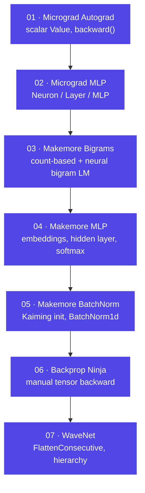

# Neural Networks: Zero to Hero

A classroom-ready walkthrough of Andrej Karpathy's course, rebuilt on top of
this repository's `nnzero/` package, `notebooks/`, and tests. Each module page
starts with a short overview and a diagram, then lets you expand exactly the
concepts you need — click any **▸ collapsed section** to go deeper.

## Course roadmap

Each arrow is a dependency: module *N* reuses code and concepts introduced in
module *N-1*. `nnzero/micrograd.py` powers modules 1–2; `nnzero/layers.py` and
`nnzero/utils.py` power modules 3–7.

## How to use this site

=== "As a student"

    1. Read the **learning objectives** at the top of a module page.
    2. Look at the roadmap diagram before opening any code.
    3. Expand concepts one at a time — each `??? note` block is a single idea,
       with the relevant source excerpt right next to the explanation.
    4. Do the **Try it yourself** exercise before checking `docs/exercises.md`
       extensions.

=== "As an instructor"

    - Every module page cites the exact file and function in `nnzero/` so you
      can walk through real code live instead of slides.
    - The **Common pitfalls** tab per module is drawn from what students
      actually get wrong (wrong gradient order, forgetting `zero_grad`,
      train/eval mode mismatches, etc.).
    - The [Exercise index](exercises.md) is rated by difficulty (⭐/⭐⭐/⭐⭐⭐) so
      you can assign work matching a cohort's pace.

## Modules at a glance

| # | Module | Core question it answers |
|---|--------|---------------------------|
| 01 | [Micrograd Autograd](module-01-micrograd-autograd.md) | How does `.backward()` actually work? |
| 02 | [Micrograd MLP](module-02-micrograd-mlp.md) | How do scalars become a trainable network? |
| 03 | [Makemore Bigrams](module-03-makemore-bigrams.md) | What's the simplest possible language model? |
| 04 | [Makemore MLP](module-04-makemore-mlp.md) | How do embeddings + a hidden layer beat bigrams? |
| 05 | [Makemore BatchNorm](module-05-makemore-batchnorm.md) | Why do deep nets get hard to train, and how does BatchNorm fix it? |
| 06 | [Backprop Ninja](module-06-makemore-backprop-ninja.md) | Can you derive every gradient by hand, without `.backward()`? |
| 07 | [WaveNet](module-07-makemore-wavenet.md) | How do you scale context length without a huge flat layer? |

Reference material: [Glossary](glossary.md) · [Exercise index](exercises.md) · [Setup guide](setup.md)
