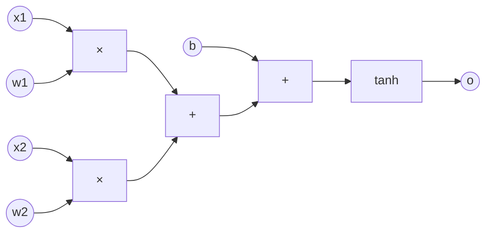

# 01 · Micrograd Autograd

**Core question:** How does `.backward()` actually work?

:material-notebook: [`notebooks/01_micrograd_autograd.ipynb`](https://github.com/karpathy/nn-zero-to-hero/blob/master/notebooks/01_micrograd_autograd.ipynb) ·
:material-file-code: [`nnzero/micrograd.py`](https://github.com/karpathy/nn-zero-to-hero/blob/master/nnzero/micrograd.py)

## Learning objectives

- Estimate a derivative numerically and use it to sanity-check an analytic gradient.
- Explain what a `Value` node stores and why it needs a `_backward` closure.
- Implement reverse-mode autodiff over a scalar computation graph using a topological sort.
- Apply the chain rule by hand for `+`, `*`, `tanh`, `exp`, and `relu`.
- Explain gradient accumulation for values reused in multiple branches.

## Roadmap



Every circle/box above is a `Value` (`nnzero/micrograd.py:21`). Calling `o.backward()`
walks this graph right-to-left, seeding `o.grad = 1.0` and multiplying each node's
**local** derivative by the gradient flowing in from the right.

??? example "Backward pass order (sequence diagram)"
    ```mermaid
    sequenceDiagram
        participant o as o (tanh out)
        participant s as add2 (+)
        participant a1 as add1 (+)
        participant m1 as m1 (x1*w1)
        participant m2 as m2 (x2*w2)
        o->>o: grad = 1.0
        o->>s: local_grad(tanh) * o.grad
        s->>a1: local_grad(+) * s.grad
        s->>b: local_grad(+) * s.grad
        a1->>m1: local_grad(+) * a1.grad
        a1->>m2: local_grad(+) * a1.grad
        m1->>x1: other.data * m1.grad
        m1->>w1: self.data * m1.grad
        m2->>x2: other.data * m2.grad
        m2->>w2: self.data * m2.grad
    ```
    This is exactly `Value.backward()` (`nnzero/micrograd.py:139`): build a topological
    order with `build_topo`, then call `node._backward()` in **reverse**.

## Key concepts

??? note "Numerical derivatives as a sanity check"
    Before trusting an analytic gradient, estimate it with a tiny perturbation:

    ```python
    def numerical_grad(f, x, h=1e-5):
        return (f(x + h) - f(x)) / h
    ```

    This gives an independent reference. Whenever you add a new operation to `Value`
    (e.g. `log()`), check its `_backward` against this formula first.

??? note "`Value` objects as tiny tensors"
    `Value` (`nnzero/micrograd.py:21`) wraps a scalar and remembers:

    - `data` — the forward value.
    - `grad` — sensitivity of the final output to this node (starts at `0.0`).
    - `_prev` — parent nodes that produced it.
    - `_op` — the operator string, used only for `draw_dot` visualization.
    - `_backward` — a closure that knows the *local* derivative for this one op.

    This is precisely the bookkeeping PyTorch keeps on a tensor with
    `requires_grad=True` — just for one number instead of an array.

??? note "Reverse-mode autodiff via topological sort"
    `backward()` (`nnzero/micrograd.py:139`) first calls `build_topo` to order every
    ancestor so a node always appears **after** all of its children. It then reverses
    that list and calls each node's `_backward()`. This guarantees `out.grad` is fully
    accumulated *before* it's used to push gradients further back — skip the sort and
    a node can be processed with a stale (too-small) gradient.

??? note "Local derivatives and the chain rule"
    Each op only needs to know its own local derivative:

    | Op | Forward | Local derivative applied in `_backward` |
    |----|---------|-------------------------------------------|
    | `+` | `self.data + other.data` | `1.0` to both operands |
    | `*` | `self.data * other.data` | `other.data` to `self`, `self.data` to `other` |
    | `**k` | `self.data ** k` | `k * self.data**(k-1)` |
    | `tanh` | `math.tanh(self.data)` | `1 - t**2` |
    | `exp` | `math.exp(self.data)` | `out.data` (itself) |
    | `relu` | `max(0, self.data)` | `1` if `self.data > 0` else `0` |

    See `nnzero/micrograd.py:56-137` for every `_backward` closure.

??? note "Gradient accumulation for reused values"
    If a value feeds into two branches (e.g. `a + a`, or `a` used in two products),
    every branch that reads `a` contributes to `a.grad`. That's why `_backward` always
    uses `self.grad += ...`, never `self.grad = ...` — addition implements the
    multivariate chain rule automatically.

=== "Common pitfalls"

    - **Forgetting to zero gradients.** `Value.grad` accumulates across calls. Calling
      `backward()` twice on the same graph without resetting `.grad = 0.0` first
      doubles every gradient.
    - **Confusing `data` and `grad`.** `data` is the forward value; `grad` is *how
      much the final output changes* if this value changes — a sensitivity relative
      to whichever node you called `.backward()` on, not an absolute property of `x`.
    - **Wrong order in backprop.** Without the topological sort, a node can be visited
      before its children finish contributing, giving a stale `out.grad`.
    - **Perturbing the wrong variable in finite differences.** When checking `do/dw1`,
      only `w1.data` should change between the two forward passes.

=== "Try it yourself"

    1. Add `log()` to `Value`, derive its local gradient (`1/x`), and verify it against
       a numerical derivative.
    2. Visualize a small expression's computation graph with `draw_dot`
       (`nnzero/micrograd.py:179`).
    3. Re-implement the single-neuron forward pass with `torch.Tensor(requires_grad=True)`,
       call `.backward()`, and confirm PyTorch's gradients match the hand-rolled engine.

    See `tests/test_micrograd.py` for the pattern used to check `Value` gradients
    against finite differences.

## Notation

This module is intentionally **scalar** — every `Value` holds one real number, so
every shape is `()`. Expressions like `x1*w1 + x2*w2 + b` are written node-by-node so
each `+`, `*`, and `tanh` is a distinct graph vertex. Later modules lift this same
logic to tensors.

---

**Next:** [02 · Micrograd MLP](module-02-micrograd-mlp.md) — turn `Value` into `Neuron`, `Layer`, and `MLP`.
