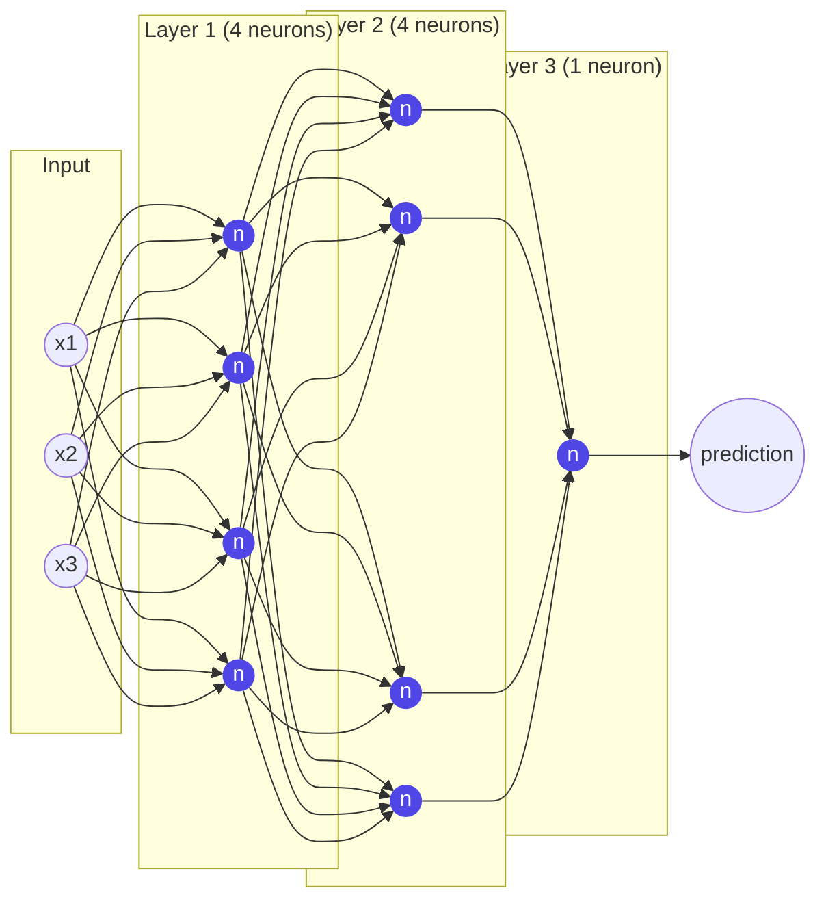

# 02 · Micrograd MLP

**Core question:** How do scalars become a trainable network?

:material-notebook: [`notebooks/02_micrograd_mlp.ipynb`](https://github.com/karpathy/nn-zero-to-hero/blob/master/notebooks/02_micrograd_mlp.ipynb) ·
:material-file-code: [`nnzero/micrograd.py`](https://github.com/karpathy/nn-zero-to-hero/blob/master/nnzero/micrograd.py)

## Learning objectives

- Build `Neuron`, `Layer`, and `MLP` purely from `Value` objects.
- Explain why gradients must be zeroed before every `backward()` call.
- Run a full forward → loss → zero_grad → backward → update training loop.
- Reason about parameter counts for a given architecture.

## Roadmap



`MLP(3, [4, 4, 1])` (`nnzero/micrograd.py:246`) builds exactly this `3 → 4 → 4 → 1`
stack: a list of `Layer` objects, each a list of `Neuron` objects, each computing
`tanh(w·x + b)` with plain `Value` arithmetic — no matrices, just nested Python loops.

## Key concepts

??? note "A neuron is a structured graph of Values"
    `Neuron.__call__` (`nnzero/micrograd.py:224`):

    ```python
    act = sum((wi * xi for wi, xi in zip(self.w, x, strict=True)), self.b)
    return act.tanh()
    ```

    `tanh(w·x + b)` is just addition, multiplication, and activation composed
    together — every weight, bias, and intermediate result is an explicit `Value`
    node with its own `.grad`. There is no hidden magic once module 01's engine exists.

??? note "Why gradients must be zeroed before backward()"
    Every `_backward` uses `self.grad += ...`, so gradients accumulate across
    repeated `backward()` calls. Before each new optimization step you must reset
    every parameter's `.grad` to `0.0` — this is exactly what
    `optimizer.zero_grad()` does in PyTorch.

??? note "Gradient descent on parameters"
    After `loss.backward()`, every parameter is nudged opposite its gradient:

    ```python
    for p in model.parameters():
        p.data += -learning_rate * p.grad
    ```

    Repeating forward → loss → zero → backward → update drives predictions toward
    targets. `MLP.parameters()` (`nnzero/micrograd.py:263`) flattens every
    `Neuron`'s weights and bias across every `Layer` so this loop can update them all.

??? note "Parameter counts by architecture"
    | Component | Parameters |
    |---|---|
    | `Neuron(nin)` | `nin` weights + 1 bias = `nin + 1` |
    | `Layer(nin, nout)` | `nout` neurons → `nout * (nin + 1)` |
    | `MLP(nin, nouts=[4, 4, 1])` on `nin=3` | `4*(3+1) + 4*(4+1) + 1*(4+1) = 16+20+5 = 41` |

=== "Common pitfalls"

    - **Writing `self.grad = ...` instead of `+=` in a new `_backward`.** Overwrites
      instead of accumulating — breaks any node reused in more than one branch.
    - **Misreading `o.grad = 1.0`.** It isn't learned or guessed — it's simply
      `do/do = 1`, the seed that starts the chain rule.
    - **Confusing scalar `Value` with vectorized tensors.** Everything here is a
      scalar object; the MLP works because Python loops over lists of `Value`s
      replicate what matrix multiplication will do starting in module 04. This is
      deliberate scaffolding, not an oversight.
    - **Too-large weight init or learning rate.** The toy network uses
      `random.uniform(-1, 1)` (`nnzero/micrograd.py:221`) and a learning rate around
      `0.1`. If training diverges or oscillates, suspect these first.

=== "Try it yourself"

    1. Add `relu()` to `Value` (module 01 already has it at `nnzero/micrograd.py:129`)
       and retrain the MLP with ReLU instead of `tanh`. Compare convergence.
    2. Swap the mean-squared-error loss for a hand-rolled sigmoid + log loss and
       compare final predictions/gradients against PyTorch.
    3. Implement mini-batch gradient descent: average the loss over several examples
       before each update instead of one at a time.

    `tests/test_micrograd.py` covers `Neuron`/`Layer`/`MLP` shapes and parameter
    counts — a good template for verifying your extensions.

## Notation

- Input `x`: list of `nin` scalars, e.g. `[2.0, 3.0, -1.0]` → shape `(3,)`.
- `Layer(nin, nout).__call__` (`nnzero/micrograd.py:238`) returns a single `Value`
  when `nout == 1`, otherwise a `list[Value]`.
- Loss: `sum((yout - ygt)**2)` over all training examples — a single scalar `Value`
  whose `.backward()` populates every parameter's `.grad`.

---

**Next:** [03 · Makemore Bigrams](module-03-makemore-bigrams.md) — leave scalars behind and move to `torch.Tensor` for a real language model.
