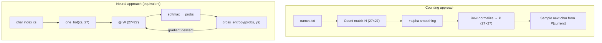

# 03 · Makemore Bigrams

**Core question:** What's the simplest possible language model?

:material-notebook: [`notebooks/03_makemore_bigrams.ipynb`](https://github.com/karpathy/nn-zero-to-hero/blob/master/notebooks/03_makemore_bigrams.ipynb) ·
:material-file-code: [`nnzero/utils.py`](https://github.com/karpathy/nn-zero-to-hero/blob/master/nnzero/utils.py)

## Learning objectives

- Build a character-pair count matrix and normalize it into a probability table.
- Explain why Laplace (add-`alpha`) smoothing is necessary.
- Connect negative log-likelihood to cross-entropy loss.
- Rewrite the exact same bigram model as a one-layer neural network and confirm the two approaches converge to equivalent solutions.

## Roadmap

Both paths estimate `P(next_char | current_char)`. With enough training, the
learned weight matrix `W` converges to the same information as the log-count
table `log(N)` — the neural framing just scales to deeper models later.

## Key concepts

??? note "Bigram model"
    A bigram model predicts each character conditioned only on the single character
    immediately before it: `P(next | current)`. All pair counts live in a `27 × 27`
    matrix — 26 letters plus a `.` start/end token (see `build_vocab`,
    `nnzero/utils.py:23`, which assigns `.` index `0`).

??? note "Counting and normalizing"
    Build a count matrix `N`, then divide each row by its row sum to get
    probabilities — the simplest possible way to estimate a conditional
    distribution directly from data, no gradient descent required.

??? note "Laplace smoothing"
    Adding a constant (e.g. `+1`) to every count before normalizing prevents zero
    probabilities. Without it, an unseen bigram gives `-inf` log-likelihood and can
    break sampling entirely.

??? note "Negative log-likelihood"
    A good model assigns high probability to the real data. Maximizing the product
    of probabilities over a dataset is equivalent to minimizing the average
    **negative** log-likelihood — this is exactly the cross-entropy loss used for
    classification everywhere else in the course.

??? note "Bigram as a neural network"
    The same model can be written as `one_hot(x) @ W`, then `softmax`. Each one-hot
    vector selects exactly one row of `W`, so `W` *is* the log-count table once
    trained. This reframing is what lets modules 04–07 scale to much richer models.

=== "Common pitfalls"

    - **Rows vs. columns.** Rows are the current character, columns are the next.
      Mixing this up samples from the wrong conditional distribution.
    - **Forgetting `keepdim=True`.** `P.sum(1, keepdim=True)` gives shape `(27, 1)`
      and broadcasts correctly. Without it, the result is `(27,)` and PyTorch
      silently broadcasts the wrong way, producing an invalid probability matrix.
    - **Zero probabilities without smoothing.** Run the `alpha=0` case to see `-inf`
      loss and nonsensical sampling — this motivates why even a tiny smoothing
      constant matters.
    - **Dismissing one-hot as wasteful.** Here it's the whole point: each one-hot
      vector selects one row of `W`, making the counting ↔ neural-network
      equivalence explicit.

=== "Try it yourself"

    1. Tune the smoothing constant `alpha` and observe the effect on loss and
       sampled names. ⭐
    2. Vectorize the loss using `F.cross_entropy` instead of a manual softmax loop
       and verify numerically it matches. ⭐⭐
    3. Implement a trigram model (condition on the previous **two** characters).
       How quickly does the count matrix become sparse?

## Tensor shapes

| Tensor | Shape | Meaning |
|--------|-------|---------|
| `N` | `(27, 27)` | Raw bigram counts |
| `P` | `(27, 27)` | Row-normalized probabilities |
| `P.sum(1, keepdim=True)` | `(27, 1)` | Normalizing constants, broadcast over columns |
| `xs`, `ys` | `(num_bigrams,)` | Input / target character indices |
| `xenc = F.one_hot(xs, 27)` | `(num_bigrams, 27)` | One-hot input matrix |
| `W` | `(27, 27)` | Learned weight matrix (≈ log-counts) |
| `logits = xenc @ W` | `(num_bigrams, 27)` | Scores for next character |
| `probs = softmax(logits)` | `(num_bigrams, 27)` | Predicted next-character distribution |

`nnzero/utils.py:39` (`build_dataset`) generalizes this to arbitrary `block_size`;
with `block_size=1` it squeezes the context into a 1-D tensor of previous-character
indices, exactly matching `xs` above.

---

**Next:** [04 · Makemore MLP](module-04-makemore-mlp.md) — replace the single weight matrix with embeddings + a hidden layer.
