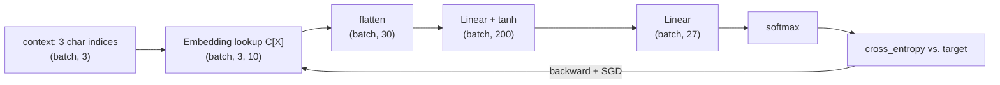
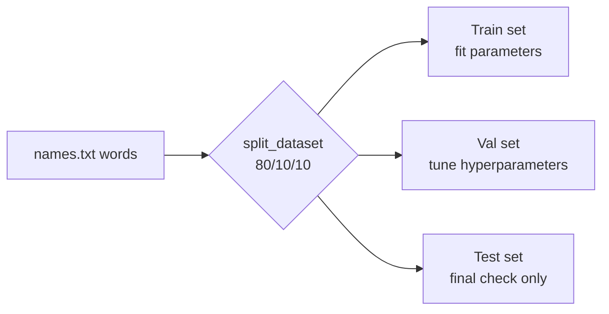

# 04 · Makemore MLP

**Core question:** How do embeddings + a hidden layer beat bigrams?

:material-notebook: [`notebooks/04_makemore_mlp.ipynb`](https://github.com/karpathy/nn-zero-to-hero/blob/master/notebooks/04_makemore_mlp.ipynb) ·
:material-file-code: [`nnzero/utils.py`](https://github.com/karpathy/nn-zero-to-hero/blob/master/nnzero/utils.py) ·
:material-file-code: [`nnzero/layers.py`](https://github.com/karpathy/nn-zero-to-hero/blob/master/nnzero/layers.py)

## Learning objectives

- Explain how a learned embedding table replaces one-hot vectors.
- Trace how a fixed context window is embedded, flattened, and fed into a hidden layer.
- Justify why a non-linearity is required between stacked linear layers.
- Split data into train/val/test and explain what each split is used for.
- Contrast sampling (`torch.multinomial`) with greedy argmax generation.

## Roadmap

## Key concepts

??? note "Embedding lookup table"
    Each of the 27 characters gets a learned vector stored in a matrix `C`.
    Indexing `C[X]` replaces every character index with its embedding vector,
    turning discrete symbols into continuous vectors the network can arrange by
    similarity. See `Embedding` (`nnzero/layers.py:135`) for the reusable version:
    `self.weight[ix]`.

??? note "Context window and flattening"
    `block_size=3` means each example feeds the previous three characters into the
    model. After embedding, shape `(batch, 3, emb_dim)` is flattened to
    `(batch, 3 * emb_dim)` so it can be multiplied by the first weight matrix.
    `build_dataset` (`nnzero/utils.py:39`) builds the sliding-window `(X, Y)` pairs;
    the context starts filled with the `.` start token (index `0`).

??? note "Hidden non-linearity"
    `h = tanh(embcat @ W1 + b1)`. Without `tanh`, stacking two linear layers would
    collapse algebraically into a single linear layer — the non-linearity is what
    lets depth add expressive power.

??? note "Softmax and cross-entropy loss"
    Output logits become a probability distribution over the next character.
    Minimizing `F.cross_entropy(logits, targets)` is equivalent to maximizing the
    log-likelihood of the correct next character, computed in a numerically stable
    way (subtract the row max before `exp` — revisited explicitly in module 06).

??? note "Mini-batch SGD with learning-rate decay"
    Gradients are estimated on small random batches (e.g. 32 examples) rather than
    the full dataset. A learning rate that starts high (`0.1`) and drops (`0.01`)
    after most of training lets the optimizer take large steps early and fine-tune
    later.

=== "Common pitfalls"

    - **Shape mismatches after flattening.** With `block_size=3, emb_dim=10`, the
      flattened input must be `(batch, 30)`, so `W1` must be `(30, hidden_size)`.
      Changing the embedding dimension requires resizing `W1` to match.
    - **Forgetting to zero gradients.** Omitting `p.grad = None` before
      `loss.backward()` accumulates gradients across iterations and the optimizer
      diverges or oscillates.
    - **Confusing train/val/test loss.** Tune embedding size, hidden size, etc. on
      the **validation** set. The **test** set is reserved for the final number
      only — `split_dataset` (`nnzero/utils.py:87`) enforces an 80/10/10 split.
    - **Sampling vs. argmax.** Always picking the most likely next character
      produces repetitive output; `sample_from_model` (`nnzero/utils.py:114`) uses
      `torch.multinomial` to draw from the full distribution instead.

=== "Try it yourself"

    1. Vary `block_size` and observe train/val loss. ⭐
    2. Visualize the trained embedding matrix `C` in 2-D and interpret clusters —
       do vowels group together? ⭐⭐
    3. Add a second hidden layer, or implement a simple learning-rate finder.
    4. Divide logits by a `temperature` before softmax: `<1.0` sharpens output,
       `>1.0` makes it more random.

## Tensor shapes

| Tensor | Shape | Meaning |
|--------|-------|---------|
| `Xtr` | `(N, 3)` | Training indices for 3-character contexts |
| `C` | `(27, 10)` | Embedding matrix: 27 characters × 10 dims |
| `emb` | `(32, 3, 10)` | Batch of 32 contexts after embedding |
| `emb.view(-1, 30)` | `(32, 30)` | Flattened context vectors |
| `W1`, `b1` | `(30, 200)`, `(200,)` | First layer weights/bias |
| `h` | `(32, 200)` | Hidden activations after `tanh` |
| `W2`, `b2` | `(200, 27)`, `(27,)` | Output layer weights/bias |
| `logits` | `(32, 27)` | Scores for each character in the batch |
| `loss` | scalar | Mean cross-entropy over the mini-batch |

---

**Next:** [05 · Makemore BatchNorm](module-05-makemore-batchnorm.md) — this MLP gets deeper, and needs BatchNorm to stay trainable.
