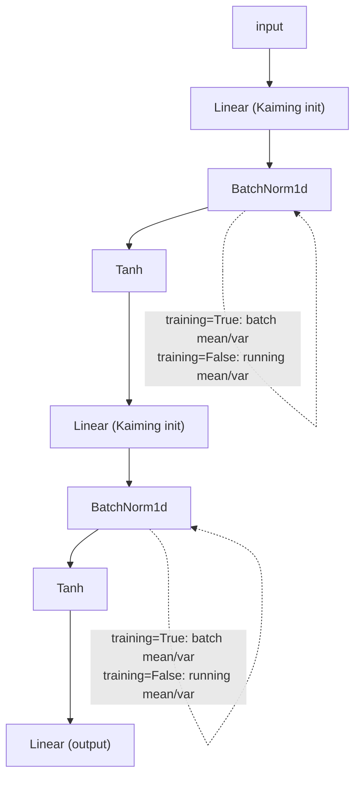

# 05 · Makemore BatchNorm

**Core question:** Why do deep nets get hard to train, and how does BatchNorm fix it?

:material-notebook: [`notebooks/05_makemore_batchnorm.ipynb`](https://github.com/karpathy/nn-zero-to-hero/blob/master/notebooks/05_makemore_batchnorm.ipynb) ·
:material-file-code: [`nnzero/layers.py`](https://github.com/karpathy/nn-zero-to-hero/blob/master/nnzero/layers.py)

## Learning objectives

- Explain why Kaiming initialization keeps `tanh` out of saturation.
- Derive what BatchNorm computes in training mode vs. evaluation mode.
- Explain why running statistics are needed for deterministic inference.
- Read activation/gradient histograms to diagnose a healthy vs. unhealthy deep network.

## Roadmap

This is exactly the `Sequential` stack (`nnzero/layers.py:183`) of `Linear` →
`BatchNorm1d` → `Tanh` blocks. `Sequential.train()` / `.eval()`
(`nnzero/layers.py:198`) flips every layer's `training` flag together, which
matters because `BatchNorm1d.__call__` (`nnzero/layers.py:95`) branches on it.

## Key concepts

??? note "Kaiming (He) initialization"
    Weights are sampled from `N(0, 1/fan_in)` — `Linear` (`nnzero/layers.py:57`)
    implements this as `torch.randn((fan_in, fan_out)) / fan_in**0.5`. For `tanh`,
    a gain of `5/3` is often applied on top. This keeps pre-activation variance
    close to `1`, so `tanh` stays in its (near-linear, non-saturated) middle region
    and gradients don't vanish.

??? note "Batch normalization"
    Before the non-linearity, subtract the batch mean and divide by the batch
    standard deviation, then apply a **learned** scale `gamma` and shift `beta`
    (`BatchNorm1d.__call__`, `nnzero/layers.py:95`). This fixes the distribution
    feeding each layer, reduces sensitivity to initialization, and allows larger
    learning rates.

??? note "Running statistics for inference"
    During training, BatchNorm uses the current mini-batch's mean/variance. During
    evaluation it uses exponential moving averages accumulated during training
    (`self.running_mean`, `self.running_var`, updated with `self.momentum` at
    `nnzero/layers.py:111-119`), so predictions become deterministic and stop
    depending on which batch an example happens to sit in.

??? note "Modular layers mimicking PyTorch"
    `Module` (`nnzero/layers.py:18`) exposes `__call__` for forward and
    `parameters()` for optimization — the same shape as `torch.nn.Module`.
    `Linear`, `BatchNorm1d`, `Tanh` all implement this tiny interface, which is why
    `Sequential` can chain arbitrary combinations of them.

??? note "Activation and gradient diagnostics"
    Histograms of `tanh` outputs, per-layer gradients, and the
    update-to-parameter ratio (`std(update) / std(parameter)`) reveal whether the
    network is saturated, whether gradients are exploding/vanishing, and whether
    every layer is learning at a similar rate.

=== "Common pitfalls"

    - **Forgetting `training = False` at inference.** BatchNorm must use running
      stats when sampling/evaluating, or output depends on the current batch and
      predictions become unstable. Always call `.eval()` (`nnzero/layers.py:204`)
      before generating samples.
    - **Confusing batch stats with running stats.** Batch stats come from the
      current mini-batch; running stats update with a momentum term (`0.1` by
      default here) and are used only at evaluation time.
    - **Removing BatchNorm without fixing initialization.** Disabling BatchNorm
      while keeping large weight scales pushes `tanh` into saturation — gradients
      vanish and training plateaus.
    - **Treating BatchNorm as a substitute for good init.** They work *together*;
      BatchNorm makes deep nets much easier to train but doesn't remove the need
      for reasonable initialization.
    - **Coupling examples inside a batch.** Because BatchNorm normalizes across the
      batch, changing one example slightly affects every other example's
      normalized value in that batch — fine in training, which is exactly why
      inference must switch to running stats.

=== "Try it yourself"

    1. Remove Kaiming init and observe activation/gradient statistics. ⭐⭐
    2. Remove `BatchNorm1d` from a deep network and observe training instability. ⭐⭐
    3. Implement LayerNorm instead of BatchNorm and compare.
    4. Plot activation histograms at multiple training stages.

## Tensor shapes

| Tensor | Shape | Meaning |
|--------|-------|---------|
| `Xb` | `(batch_size, block_size)` | Integer context indices |
| `emb = C[Xb]` | `(batch_size, block_size, n_embd)` | Embedding lookup |
| `embcat` | `(batch_size, block_size * n_embd)` | Flattened embeddings |
| `hpreact = embcat @ W1` | `(batch_size, n_hidden)` | Hidden pre-activation |
| `bnmeani`, `bnstdi` | `(1, n_hidden)` | Batch mean/std over the batch dimension |
| `h = tanh(hpreact)` | `(batch_size, n_hidden)` | Hidden activation |
| `logits = h @ W2 + b2` | `(batch_size, vocab_size)` | Output logits |

`BatchNorm1d.__call__` (`nnzero/layers.py:95-121`) also handles the 3-D case
`(B, T, C)` used from module 07 onward, averaging over dims `(0, 1)` instead of
just `0`.

---

**Next:** [06 · Backprop Ninja](module-06-makemore-backprop-ninja.md) — derive every one of these gradients by hand, without `.backward()`.
