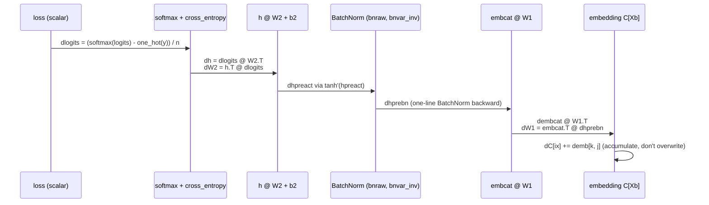

# 06 · Backprop Ninja

**Core question:** Can you derive every gradient by hand, without `.backward()`?

:material-notebook: [`notebooks/06_makemore_backprop_ninja.ipynb`](https://github.com/karpathy/nn-zero-to-hero/blob/master/notebooks/06_makemore_backprop_ninja.ipynb)

## Learning objectives

- Split a forward pass into tiny, individually-differentiable operations.
- Apply the chain rule to tensors, including correct broadcasting/`keepdim` handling.
- Derive the compact one-line gradients for softmax-cross-entropy and BatchNorm.
- Explain why embedding gradients must accumulate rather than overwrite.

## Roadmap



This is `torch.autograd` made explicit: every arrow is one manual gradient,
verified against `torch.autograd` with `torch.allclose` in the notebook, walked
in **reverse topological order** — exactly the same principle module 01
introduced with `build_topo` (`nnzero/micrograd.py:149`), now applied to tensors
with real shapes instead of scalars.

## Key concepts

??? note "Forward pass as simple operations"
    Backprop requires splitting the forward pass into tiny, differentiable steps:
    embedding lookup, matrix multiply, mean, variance, reciprocal square-root,
    tanh, softmax. Each step has an easy local gradient; composed together they
    make a full language model.

??? note "Backpropagation is the chain rule in reverse"
    For every tensor `x`, compute `dL/dx` by multiplying the upstream gradient
    against the local Jacobian. Process variables in reverse topological
    order — children before parents — because a parent's gradient depends on all
    of its children's gradients being finished first.

??? note "Numerical stability in softmax"
    Subtract the per-row maximum from logits before exponentiating. This doesn't
    change the resulting probabilities but prevents `exp()` overflow.
    `F.cross_entropy` applies the same trick internally, which is why the library
    call is preferred once you understand the derivation by hand.

??? note "Compact cross-entropy gradient"
    Cross-entropy after softmax simplifies to:

    ```
    dlogits = (softmax(logits) - one_hot(target)) / n
    ```

    This single line replaces nine intermediate variables (`logprobs`, `probs`,
    `counts`, ...) and is the form actually used in production code.

??? note "Compact BatchNorm gradient"
    BatchNorm centers and whitens a batch, then rescales with learnable `gamma`
    and `beta`. Its input gradient can be written in one line using only
    `dhpreact`, `bnraw`, and `bnvar_inv`, skipping every intermediate mean/variance
    step you'd otherwise need to differentiate separately.

=== "Common pitfalls"

    - **Forgetting `keepdim=True`.** `bnmeani`, `bnvar_inv`, and `logit_maxes` keep
      an extra dimension so broadcasting works. Preserve those shapes in your
      gradients, or reductions silently produce the wrong dimensions.
    - **Dropping the `1/n` loss scale.** The final loss is a mean over the batch,
      so every gradient carries a `1/n` factor. Omitting it makes updates `n`×
      too large and training diverges.
    - **Confusing `hprebn` with `hpreact`.** `hprebn` is the linear output *before*
      BatchNorm; `hpreact` is *after* scale/shift. The `tanh` derivative applies to
      `hpreact`; BatchNorm's backward pass bridges the two.
    - **Using `1 / counts_sum` instead of `counts_sum**-1`.** The notebook uses the
      power form so manual backprop is bit-exact with PyTorch — small choices like
      this matter when checking gradients with `torch.allclose`.
    - **Forgetting to accumulate embedding gradients.** `C[Xb]` indexes the
      embedding matrix, so the same character can appear multiple times in a
      batch. Use `dC[ix] += demb[k, j]`, never `=`, or earlier occurrences get
      overwritten.

=== "Try it yourself"

    1. Derive the backward pass for `ReLU` or `GELU` instead of `tanh`. Compare
       training speed and final loss.
    2. Add a second hidden layer and derive the extra set of gradients.
    3. Implement inference-time BatchNorm from scratch: track exponential moving
       averages during training, use them at test time — compare against
       `BatchNorm1d` (`nnzero/layers.py:70`).

## Tensor shapes

Batch size `n = 32`, `block_size = 3`:

| Tensor | Shape | Meaning |
|--------|-------|---------|
| `Xb` | `(n, 3)` | Input character indices |
| `C` | `(vocab_size, n_embd)` | Embedding matrix |
| `emb` | `(n, 3, n_embd)` | Character embeddings |
| `embcat` | `(n, 3*n_embd)` | Flattened embeddings |
| `hprebn` | `(n, n_hidden)` | Hidden pre-activations before BatchNorm |
| `bnmeani`, `bnvar_inv` | `(1, n_hidden)` | Batch statistics |
| `bnraw`, `hpreact`, `h` | `(n, n_hidden)` | Normalized, scaled, activated hidden state |
| `W2`, `b2` | `(n_hidden, vocab_size)`, `(vocab_size,)` | Output layer |
| `logits` | `(n, vocab_size)` | Model scores |

Matrix multiply transpose rule: if `logits = h @ W2`, then
`dW2 = h.T @ dlogits` and `dh = dlogits @ W2.T`.

---

**Next:** [07 · WaveNet](module-07-makemore-wavenet.md) — put `.backward()` back, and scale context length with a hierarchical architecture.
