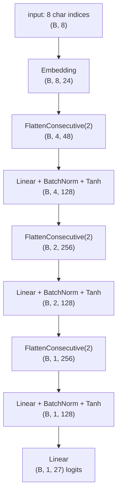

# 07 · WaveNet

**Core question:** How do you scale context length without a huge flat layer?

:material-notebook: [`notebooks/07_makemore_wavenet.ipynb`](https://github.com/karpathy/nn-zero-to-hero/blob/master/notebooks/07_makemore_wavenet.ipynb) ·
:material-file-code: [`nnzero/layers.py`](https://github.com/karpathy/nn-zero-to-hero/blob/master/nnzero/layers.py)

## Learning objectives

- Explain how `FlattenConsecutive` merges neighboring time steps to grow the receptive field.
- Trace tensor shapes through a multi-stage hierarchical model.
- Reconnect Kaiming init + BatchNorm (module 05) to a deeper, staged architecture.
- Describe the relationship between this design and 1-D dilated convolutions.

## Roadmap



Each `FlattenConsecutive(2)` (`nnzero/layers.py:160`) halves the time dimension
and doubles the feature dimension: `(B, T, C) → (B, T//2, C*2)`. Stack three of
them over `block_size=8` and the receptive field grows `2 → 4 → 8` — local
patterns are learned first and composed into longer-range structure, rather
than flattening the whole context into one giant vector like module 04 did.

??? example "Receptive-field growth as a merge tree"
    ```mermaid
    flowchart BT
        c1((c1)) --> p1(( ))
        c2((c2)) --> p1
        c3((c3)) --> p2(( ))
        c4((c4)) --> p2
        c5((c5)) --> p3(( ))
        c6((c6)) --> p3
        c7((c7)) --> p4(( ))
        c8((c8)) --> p4
        p1 --> q1(( ))
        p2 --> q1
        p3 --> q2(( ))
        p4 --> q2
        q1 --> r((final: sees all 8))
        q2 --> r
    ```
    Each level is one `FlattenConsecutive(2)` + `Linear`. This is precisely the
    structure a WaveNet-style dilated convolution stack computes, just written as
    explicit reshapes instead of a convolution.

## Key concepts

??? note "Hierarchical receptive field"
    Each `FlattenConsecutive(2)` layer groups neighboring time steps and merges
    them, so the first stage sees 2 characters, the second sees 4, the third sees
    8. The network learns local patterns first and composes them into longer-range
    structure — matching how real sequences have structure at many scales.

??? note "FlattenConsecutive"
    `nnzero/layers.py:160`: reshapes `(B, T, C)` into `(B, T//n, C*n)` by merging
    `n` consecutive positions along the feature dimension. If the resulting time
    dimension is `1`, it's squeezed to `(B, C*n)` (`nnzero/layers.py:177`) so the
    final layer's output matches the flat `(B, vocab_size)` shape modules 03–06
    already expect.

??? note "Kaiming initialization (revisited)"
    Still essential here — deep stacks (three stages + output layer) can suffer
    exploding/vanishing activations without it. Same `1/sqrt(fan_in)` scaling from
    `Linear` (`nnzero/layers.py:57`), now applied at every stage.

??? note "Batch normalization (revisited)"
    `BatchNorm1d` (`nnzero/layers.py:70`) now normalizes 3-D input `(B, T, C)` by
    averaging over dims `(0, 1)` instead of just `0` — see the `dim = 0 if x.ndim
    == 2 else (0, 1)` branch at `nnzero/layers.py:99`. Same train/eval running-stats
    behavior as module 05.

??? note "Cross-entropy and SGD with decay"
    Same training recipe as modules 04–06: `F.cross_entropy` against the true
    next-character index, plain SGD with a learning-rate drop (`0.1 → 0.01`) once
    most progress has been made.

=== "Common pitfalls"

    - **Forgetting eval mode.** BatchNorm layers use running mean/variance at test
      time; call `Sequential.eval()` (`nnzero/layers.py:204`) before sampling or
      validation loss will be unreliable.
    - **Mismatched `block_size` and stage count.** Each `FlattenConsecutive(2)`
      doubles the receptive field; three stages need exactly `block_size = 8`.
      Adding/removing a stage without changing `block_size` causes shape errors or
      wastes context.
    - **Confusing flattening with convolutions.** `FlattenConsecutive` is applied
      globally across batch and sequence, reusing the same linear weights for
      every local patch — it's algebraically close to, but not identical in
      implementation to, a 1-D convolution.

=== "Try it yourself"

    1. Try `block_size = 16` with a fourth `FlattenConsecutive(2)` stage, or reduce
       to `block_size = 4`. Does longer context actually help on this dataset? ⭐⭐⭐
    2. Replace `FlattenConsecutive` with `torch.nn.Conv1d` over the embedding
       dimension and compare.
    3. Add residual connections or dilated convolutions — both core WaveNet
       ingredients — once the model is deep enough to need them.

## Tensor shapes

With `block_size = 8`, batch size `B`:

| Stage | Shape |
|---|---|
| Input (char indices) | `(B, 8)` |
| Embedding (24-dim) | `(B, 8, 24)` |
| After 1st `FlattenConsecutive(2)` | `(B, 4, 48)` |
| After 1st `Linear` | `(B, 4, 128)` |
| After 2nd `FlattenConsecutive(2)` | `(B, 2, 256)` |
| After 2nd `Linear` | `(B, 2, 128)` |
| After 3rd `FlattenConsecutive(2)` | `(B, 1, 256)` |
| After 3rd `Linear` | `(B, 1, 128)` |
| Final `Linear` | `(B, 1, 27)` logits |

The leading singleton dimension is squeezed by `FlattenConsecutive`
(`nnzero/layers.py:177`) or implicitly accepted by `F.cross_entropy`, which
handles logits of shape `(B, C)` or `(B, C, ...)`.

---

This is the last module in the series — from here, the natural next step outside
this repo is a real attention-based Transformer (see the original course's later
"Let's build GPT" lecture referenced in `README.md`).
