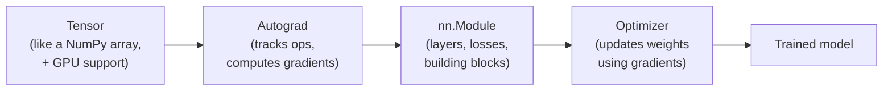

# 1. What is PyTorch?

*Adapted from Sebastian Raschka's ["PyTorch in One Hour"](https://sebastianraschka.com/teaching/pytorch-1h/) (2025).*

!!! abstract "Notebook / Script"
    [`notebooks/01_what_is_pytorch.ipynb`](https://github.com/sourangshupal/pytorch-primer/blob/main/notebooks/01_what_is_pytorch.ipynb) ·
    [`scripts/01_what_is_pytorch.py`](https://github.com/sourangshupal/pytorch-primer/blob/main/scripts/01_what_is_pytorch.py)

[PyTorch](https://pytorch.org) is an open-source Python deep learning library. It has been the
most widely used deep learning library for research since 2019, and roughly 40%+ of practitioners
use it day to day (per Kaggle's ML & DS surveys). It's popular because it balances ease of use
with the flexibility advanced users need to customize and optimize models.

## 1.1 The three core components of PyTorch

PyTorch can be understood as three things bundled together:

1. **A tensor library** — like NumPy, but with GPU acceleration built in.
2. **An automatic differentiation engine ("autograd")** — automatically computes gradients for
   backpropagation, so you never derive calculus by hand.
3. **A deep learning library** — modular building blocks (layers, loss functions, optimizers,
   pretrained models) for building and training neural networks.

We'll go through each of these three components hands-on in the notebooks that follow: tensors in
[Notebook 2](02-tensors.md), autograd in [Notebook 3](03-autograd.md), and the deep learning
library starting at [Notebook 4](04-neural-networks.md).

### The PyTorch stack, at a glance



Everything in this primer is really just repeated trips around this loop: build tensors, let
autograd track what happens to them, wrap the math in `nn.Module`s, and let an optimizer nudge the
weights down the loss. Notebooks 2-6 walk each box left to right; [Notebook 9](09-multi-gpu-ddp.md)
revisits the whole loop running on multiple GPUs at once.

## 1.2 Defining deep learning

Quick terminology, since these words get used loosely:

- **AI**: building systems that perform tasks normally requiring human intelligence.
- **Machine learning**: a subfield of AI — algorithms that learn patterns from data instead of
  being explicitly programmed.
- **Deep learning**: a subfield of machine learning that uses *deep* (many-layered) neural
  networks. Especially good at unstructured data — images, audio, text — which is why it underlies
  LLMs.

The typical **supervised learning** workflow: train a model on labeled examples → evaluate it →
use it to predict labels for new, unseen data. Training an LLM to generate text follows the same
shape — the "labels" just come from the text itself (predict the next token).

## 1.3 Installing PyTorch (with `uv`)

This project already has PyTorch declared as a dependency in `pyproject.toml`. If you're following
along in this repo, just run once from the project root:

```bash
uv sync
```

`uv` will resolve and install the **latest stable PyTorch** for your platform automatically:

- **NVIDIA GPU (CUDA) machine** → the CUDA-enabled build is installed automatically.
- **Apple Silicon (M1/M2/M3/M4+)** → PyTorch ships with MPS (Metal) acceleration built in, no
  extra flags needed.
- **CPU-only machine** → the CPU build is installed; everything in this primer still runs, just
  slower for the (tiny) models we use here.

If you ever need to install PyTorch into a *different* project from scratch, the equivalent
commands are:

```bash
uv init my-project && cd my-project
uv add torch
```

!!! tip "Version pinning tip"
    New Python releases are often not immediately supported by scientific libraries. Prefer a
    Python version 1-2 releases behind the very latest (e.g. if 3.14 just shipped, use 3.12 or
    3.13).

!!! warning "Do not hardcode a version"
    Project convention here is to always track the latest stable PyTorch release rather than
    pinning to what this tutorial happened to be written against — the API covered in this primer
    has been stable for many releases.

## Check your install and hardware

Run this first, always. It tells you the PyTorch version and picks the best available device
(CUDA > MPS > CPU) for every notebook in this primer — see [Hardware Detection](../hardware-detection.md)
for exactly how this works.

```python
import sys, os
sys.path.append(os.path.abspath(".."))  # so `utils` is importable from notebooks/

import torch
from utils.device import print_hardware_report

print("torch.__version__:", torch.__version__)
device = print_hardware_report()
```

If `CUDA available` or `MPS available` printed `True`, you have GPU acceleration ready to go
(we'll use it explicitly in [Notebook 8](08-gpu-training.md)). Otherwise you're on CPU —
completely fine for every example in this primer; the models here are intentionally tiny.

## 1.4 Why tensors instead of a Python list or a NumPy array?

The claim above was "GPU acceleration built in" — worth making concrete instead of taking on
faith. Time the same computation (elementwise multiply, then sum) three ways on a moderately-sized
array:

```python
import numpy as np

n = 2_000_000
py_a, py_b = list(range(n)), list(range(n, 2 * n))
np_a, np_b = np.arange(n), np.arange(n, 2 * n)
t_a, t_b = torch.arange(n), torch.arange(n, 2 * n)

%timeit sum(a * b for a, b in zip(py_a, py_b))   # pure Python loop
%timeit (np_a * np_b).sum()                       # NumPy, vectorized
%timeit (t_a * t_b).sum()                         # PyTorch tensor, vectorized
```

CPU-side NumPy vs. Tensor timings should land close together (both call into optimized C/BLAS
code) — the real payoff of tensors shows up once you move them to a GPU/MPS device, which
[Notebook 8](08-gpu-training.md) does explicitly.

## 1.5 A teaser: automatic differentiation

You don't need to understand this yet ([Notebook 3](03-autograd.md) covers it properly) — just
notice PyTorch computes a calculus derivative for you, without you writing any calculus:

```python
# y = x^2  ->  dy/dx = 2x  ->  at x=3.0, the derivative is 6.0
x = torch.tensor(3.0, requires_grad=True)
y = x ** 2
y.backward()

print(x.grad.item())  # 6.0 — PyTorch computed this, we never wrote "2*x" ourselves
```

!!! info "Rendering note"
    The stack diagram above is a [Mermaid](https://mermaid.js.org/) diagram. It renders here on
    the docs site, in the notebook itself (JupyterLab ≥4, VS Code), and on github.com. It will
    *not* render in `nbviewer` or a plain `nbconvert`-to-HTML export without a Mermaid script
    include.

**Next:** [2. Understanding tensors](02-tensors.md)
