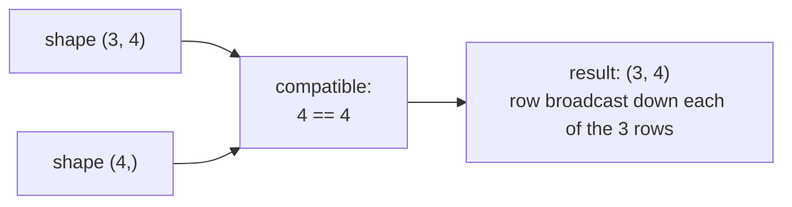

# 2. Understanding tensors

!!! abstract "Notebook / Script"
    [`notebooks/02_tensors.ipynb`](https://github.com/sourangshupal/pytorch-primer/blob/main/notebooks/02_tensors.ipynb) ·
    [`scripts/02_tensors.py`](https://github.com/sourangshupal/pytorch-primer/blob/main/scripts/02_tensors.py) ·
    See also: [Track 2 — Tensors Deep Dive](../track2-official/11-tensors-deep-dive.md)

A **tensor** generalizes vectors and matrices to arbitrary dimensions ("rank"):

| Rank | Name | Example |
|---|---|---|
| 0 | scalar | `5` |
| 1 | vector | `[1, 2, 3]` |
| 2 | matrix | `[[1, 2], [3, 4]]` |
| 3+ | "3D tensor", "4D tensor", ... | nested lists of lists |

!!! note
    A 3-*element* vector is still rank 1 — "3D" describes the tensor's **rank**, not the number of
    elements it holds.

PyTorch tensors behave like NumPy arrays, plus two deep-learning superpowers: automatic
differentiation ([Notebook 3](03-autograd.md)) and GPU acceleration ([Notebook 8](08-gpu-training.md)).

!!! tip "New to NumPy?"
    Sebastian Raschka has a good primer: <https://sebastianraschka.com/blog/2020/numpy-intro.html>

## 2.1 Scalars, vectors, matrices, and tensors

Create tensors of increasing rank with `torch.tensor`:

```python
import torch

# 0D tensor (scalar) from a Python integer
tensor0d = torch.tensor(1)

# 1D tensor (vector) from a Python list
tensor1d = torch.tensor([1, 2, 3])

# 2D tensor from a nested Python list
tensor2d = torch.tensor([[1, 2], [3, 4]])

# 3D tensor from a doubly nested Python list
tensor3d = torch.tensor([[[1, 2], [3, 4]], [[5, 6], [7, 8]]])

print(tensor0d)
print(tensor1d)
print(tensor2d)
print(tensor3d)
```

## 2.2 Tensor data types

Integers → 64-bit int by default. Floats → 32-bit float by default (a deliberate tradeoff: 32-bit
is enough precision for deep learning, uses less memory, and GPUs are optimized for it).

```python
tensor1d = torch.tensor([1, 2, 3])
print(tensor1d.dtype)          # torch.int64

floatvec = torch.tensor([1.0, 2.0, 3.0])
print(floatvec.dtype)          # torch.float32

# Convert precision explicitly with .to()
floatvec = tensor1d.to(torch.float32)
print(floatvec.dtype)          # torch.float32
```

See the full dtype list: <https://pytorch.org/docs/stable/tensors.html>

## 2.3 Common PyTorch tensor operations

A handful of operations cover most day-to-day usage.

```python
tensor2d = torch.tensor([[1, 2, 3],
                         [4, 5, 6]])
print(tensor2d)
print(tensor2d.shape)      # torch.Size([2, 3]) -> 2 rows, 3 columns
```

Reshape with `.reshape` or (the more common PyTorch idiom) `.view`:

```python
print(tensor2d.reshape(3, 2))
print(tensor2d.view(3, 2))       # same result, more idiomatic in PyTorch code
```

Transpose with `.T` (flips across the diagonal):

```python
print(tensor2d.T)
```

Matrix multiplication with `.matmul(...)` or the equivalent, more compact `@` operator:

```python
print(tensor2d.matmul(tensor2d.T))
print(tensor2d @ tensor2d.T)     # identical result, shorter
```

## 2.4 Broadcasting

When shapes don't match exactly, PyTorch tries to **broadcast** the smaller tensor across the
larger one instead of raising an error — a frequent source of silent bugs if you don't expect it.
The rule: compare shapes from the right; dimensions are compatible if they're equal or one of them
is 1.



```python
matrix = torch.tensor([[1., 2., 3.], [4., 5., 6.], [7., 8., 9.]])   # shape (3, 3)
row = torch.tensor([10., 20., 30.])                                  # shape (3,)

print(matrix + row)   # row is broadcast to every one of the 3 rows, no explicit tiling needed

# A shape that DOESN'T broadcast raises a clear error rather than guessing:
bad_shape = torch.tensor([1., 2.])  # shape (2,) — incompatible with matrix's last dim of 3
matrix + bad_shape
# RuntimeError: The size of tensor a (3) must match the size of tensor b (2) at non-singleton dimension 1
```

## 2.5 In-place vs. out-of-place operations

Methods ending in `_` (e.g. `add_`) modify the tensor **in place** instead of returning a new one.
They save memory but come with a sharp edge once autograd is involved
([Notebook 3](03-autograd.md)): modifying a tensor in place that autograd needs for computing
gradients breaks the backward pass.

```python
a = torch.tensor([1., 2., 3.])

b = a.add(1.0)     # out-of-place: returns a NEW tensor, `a` is unchanged
a.add_(1.0)        # in-place: modifies `a` itself, returns nothing new

# The autograd gotcha: y = x**2 needs x's ORIGINAL value saved to compute dy/dx = 2x later.
# Mutating x in place after y is computed destroys that saved value, so PyTorch refuses.
x = torch.tensor([1., 2., 3.], requires_grad=True)
y = x ** 2
x.add_(1.0)     # mutating x in place after y was computed from it
y.sum().backward()
# RuntimeError: a leaf Variable that requires grad is being used in an in-place operation.
```

That's the full list of tensor mechanics you need for the rest of this primer. For the complete
tensor API reference (rarely needed day to day): <https://pytorch.org/docs/stable/tensors.html>

**Next:** how PyTorch turns a sequence of tensor operations into a **computation graph** it can
differentiate automatically — [3-4. Computation graphs & autograd](03-autograd.md).
