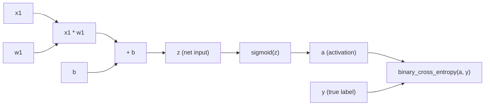
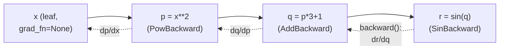

# 3-4. Computation graphs and autograd

!!! abstract "Notebook / Script"
    [`notebooks/03_computation_graphs_and_autograd.ipynb`](https://github.com/sourangshupal/pytorch-primer/blob/main/notebooks/03_computation_graphs_and_autograd.ipynb) ·
    [`scripts/03_computation_graphs_and_autograd.py`](https://github.com/sourangshupal/pytorch-primer/blob/main/scripts/03_computation_graphs_and_autograd.py) ·
    See also: [Track 2 — Autograd Deep Dive](../track2-official/15-autograd-deep-dive.md)

## 3. Seeing models as computation graphs

A **computation graph** is a directed graph laying out the sequence of calculations that produce a
neural network's output. We need this shape to later compute gradients for backpropagation — the
core training algorithm for neural networks.

### A concrete example: logistic regression forward pass

A logistic regression classifier is a single-layer neural network: multiply an input feature by a
weight, add a bias, squash with a sigmoid, and compare against a true label with a loss function.

```python
import torch
import torch.nn.functional as F

y = torch.tensor([1.0])   # true label
x1 = torch.tensor([1.1])  # input feature
w1 = torch.tensor([2.2])  # weight parameter
b = torch.tensor([0.0])   # bias unit

z = x1 * w1 + b           # net input
a = torch.sigmoid(z)      # activation -> output

loss = F.binary_cross_entropy(a, y)
print(loss)
```

Conceptually: `x1` is multiplied by `w1`, the bias `b` is added, the result passes through the
sigmoid activation `σ`, and the loss compares the output `a` against label `y`. PyTorch builds
exactly this graph in the background — and reuses it to compute gradients, which is the topic of
the next section.

### The graph PyTorch actually built



Forward pass (left-to-right, solid arrows above) computes the loss. `.backward()` walks this exact
graph **in reverse** — loss to `a` to `z` to `w1`/`b`/`x1` — applying the chain rule at each node to
work out how much each one contributed to the final loss.

## 4. Automatic differentiation made easy

If any tensor feeding into a computation has `requires_grad=True`, PyTorch tracks every operation
performed on it and builds a computation graph internally. Calling `.backward()` (or the
lower-level `grad()` function) walks that graph in reverse — applying the chain rule from calculus
— to compute gradients. This reverse traversal is exactly what "backpropagation" means.

!!! tip "You don't need to remember calculus for this"
    One-sentence version: gradients tell us how to nudge each parameter (weight, bias) to reduce
    the loss. PyTorch computes them for you.

### Manual gradient computation with `torch.autograd.grad`

Useful for debugging/demonstration — not how you'll normally do this in practice.

```python
import torch.nn.functional as F
from torch.autograd import grad

y = torch.tensor([1.0])
x1 = torch.tensor([1.1])
w1 = torch.tensor([2.2], requires_grad=True)
b = torch.tensor([0.0], requires_grad=True)

z = x1 * w1 + b
a = torch.sigmoid(z)

loss = F.binary_cross_entropy(a, y)

# retain_graph=True: keep the graph in memory so we can reuse it below
# (by default PyTorch frees it right after computing gradients, to save memory)
grad_L_w1 = grad(loss, w1, retain_graph=True)
grad_L_b = grad(loss, b, retain_graph=True)

print(grad_L_w1)
print(grad_L_b)
```

### The idiomatic way: `.backward()`

In practice you call `.backward()` on the loss, and PyTorch populates the `.grad` attribute of
every leaf tensor with `requires_grad=True`:

```python
loss.backward()

print(w1.grad)
print(b.grad)
```

!!! success "Takeaway"
    PyTorch's autograd engine means you never hand-derive gradients for training a neural
    network. `.backward()` does the calculus; you just need to remember to set
    `requires_grad=True` on your parameters (this happens automatically for `torch.nn` layers, as
    we'll see next).

### A peek at the graph object itself: `.grad_fn`

Every non-leaf tensor produced by tracked operations carries a `.grad_fn` pointing to the
operation that created it — and that operation, in turn, points to whatever created ITS inputs.
Following `.grad_fn.next_functions` walks the graph backward one link at a time — this is
literally what `.backward()` does internally, just automated:

```python
# A slightly deeper graph: two chained operations instead of one.
x = torch.tensor(2.0, requires_grad=True)
p = x ** 2          # p = x^2
q = p * 3 + 1       # q = 3*x^2 + 1
r = torch.sin(q)    # r = sin(3*x^2 + 1)

print(r.grad_fn)                 # SinBackward
print(r.grad_fn.next_functions)  # points back to q's AddBackward
print(q.grad_fn)                 # AddBackward
print(p.grad_fn)                 # PowBackward
print(x.grad_fn)                 # None — x is a leaf, nothing created it

r.backward()
# dr/dx = cos(3x^2+1) * 6x  (chain rule, applied automatically)
print(x.grad.item())
```



**Next:** [5. Building a neural network with `nn.Module`](04-neural-networks.md)
