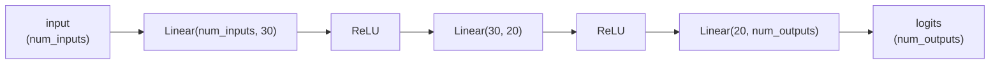

# 5. Implementing multilayer neural networks

!!! abstract "Notebook / Script"
    [`notebooks/04_building_neural_networks.ipynb`](https://github.com/sourangshupal/pytorch-primer/blob/main/notebooks/04_building_neural_networks.ipynb) ·
    [`scripts/04_building_neural_networks.py`](https://github.com/sourangshupal/pytorch-primer/blob/main/scripts/04_building_neural_networks.py) ·
    See also: [Track 2 — Build Model Deep Dive](../track2-official/14-build-model-deep-dive.md)

Now the third core PyTorch component: the deep learning library itself — reusable building blocks
for defining neural networks.

We'll implement a **multilayer perceptron (MLP)**: a fully connected network with two hidden
layers. In PyTorch, you subclass `torch.nn.Module` and define:

- `__init__`: what layers exist
- `forward`: how data flows through them (this *is* the computation graph from [Notebook 3](03-autograd.md))

You essentially never implement `backward` yourself — autograd handles it.



`self.layers` is exactly this chain, and `forward(x)` is just "run `x` through it" — the diagram
above and the `Sequential(...)` call below describe the same thing two ways.

```python
import torch

class NeuralNetwork(torch.nn.Module):
    def __init__(self, num_inputs, num_outputs):
        super().__init__()

        self.layers = torch.nn.Sequential(

            # 1st hidden layer
            torch.nn.Linear(num_inputs, 30),
            torch.nn.ReLU(),

            # 2nd hidden layer
            torch.nn.Linear(30, 20),
            torch.nn.ReLU(),

            # output layer
            torch.nn.Linear(20, num_outputs),
        )

    def forward(self, x):
        logits = self.layers(x)
        return logits
```

`torch.nn.Sequential` just chains layers in order so we don't have to call each one by hand in
`forward`. Instantiate the model and inspect it:

```python
model = NeuralNetwork(50, 3)
print(model)
```

Count trainable parameters (every `torch.nn.Linear` weight matrix + bias vector where
`requires_grad=True`):

```python
num_params = sum(
    p.numel() for p in model.parameters() if p.requires_grad
)
print("Total number of trainable model parameters:", num_params)
```

Inspect a specific layer's weight matrix:

```python
print(model.layers[0].weight)
print(model.layers[0].weight.shape)   # torch.Size([30, 50])
```

Weights are initialized with small random numbers (to break symmetry — if every neuron started
identical, they'd all learn the same thing). Seed the RNG for reproducibility:

```python
torch.manual_seed(123)
model = NeuralNetwork(50, 3)
print(model.layers[0].weight)
```

## The forward pass

Feed a random input through the (untrained) model:

```python
torch.manual_seed(123)

X = torch.rand((1, 50))
out = model(X)
print(out)
```

Notice `grad_fn=<AddmmBackward0>` on the output — PyTorch recording that this tensor came from a
matrix-multiply-then-add (`Addmm`) operation, information it needs for backpropagation.

!!! tip "Inference mode"
    If we're only predicting (not training), building the autograd graph wastes memory and
    compute. Wrap inference code in `torch.no_grad()`:
    ```python
    with torch.no_grad():
        out = model(X)
    print(out)
    ```

**Logits vs. probabilities.** PyTorch models conventionally return raw `logits` (no final
activation), because loss functions like `cross_entropy` fold the softmax in internally for
numerical stability. To get interpretable class probabilities yourself, apply softmax explicitly:

```python
with torch.no_grad():
    out = torch.softmax(model(X), dim=1)
print(out)
```

Roughly-equal probabilities here are expected — the model hasn't been trained yet.

**Next:** how to feed real, batched data into a model like this for training —
[6. Data loaders](05-data-loaders.md).
