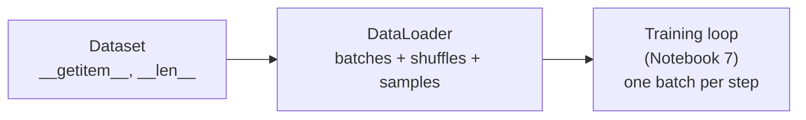

# 6. Setting up efficient data loaders

!!! abstract "Notebook / Script"
    [`notebooks/05_data_loaders.ipynb`](https://github.com/sourangshupal/pytorch-primer/blob/main/notebooks/05_data_loaders.ipynb) ·
    [`scripts/05_data_loaders.py`](https://github.com/sourangshupal/pytorch-primer/blob/main/scripts/05_data_loaders.py) ·
    See also: [Track 2 — Datasets & DataLoaders](../track2-official/12-datasets-dataloaders.md)

PyTorch splits data handling into two pieces:

- **`Dataset`**: defines how a *single* record is loaded (given an index).
- **`DataLoader`**: wraps a `Dataset` and handles shuffling + batching for you.



## A toy dataset

Five training examples (2 features each, 2 classes) and two test examples:

```python
import torch

X_train = torch.tensor([
    [-1.2, 3.1],
    [-0.9, 2.9],
    [-0.5, 2.6],
    [2.3, -1.1],
    [2.7, -1.5]
])
y_train = torch.tensor([0, 0, 0, 1, 1])

X_test = torch.tensor([
    [-0.8, 2.8],
    [2.6, -1.6],
])
y_test = torch.tensor([0, 1])
```

!!! note "Class label convention"
    PyTorch expects class labels to start at 0, with the highest label equal to
    `(number of output nodes - 1)`. 5 classes → labels `0..4` → 5 output nodes.

## A custom `Dataset`

Three methods to implement: `__init__` (store data/paths/handles), `__getitem__` (return one
example by index), `__len__` (dataset size).

```python
from torch.utils.data import Dataset

class ToyDataset(Dataset):
    def __init__(self, X, y):
        self.features = X
        self.labels = y

    def __getitem__(self, index):
        one_x = self.features[index]
        one_y = self.labels[index]
        return one_x, one_y

    def __len__(self):
        return self.labels.shape[0]

train_ds = ToyDataset(X_train, y_train)
test_ds = ToyDataset(X_test, y_test)

print(len(train_ds))   # 5
```

## Wrapping it in a `DataLoader`

```python
from torch.utils.data import DataLoader

torch.manual_seed(123)

train_loader = DataLoader(
    dataset=train_ds,
    batch_size=2,
    shuffle=True,
    num_workers=0
)

test_loader = DataLoader(
    dataset=test_ds,
    batch_size=2,
    shuffle=False,
    num_workers=0
)

for idx, (x, y) in enumerate(train_loader):
    print(f"Batch {idx+1}:", x, y)
```

Iterating over `train_loader` once visits every training example exactly once — one **epoch**.
Notice the last batch only has 1 example (5 examples don't divide evenly by batch size 2). A small
trailing batch can destabilize training, so it's common to drop it:

```python
train_loader = DataLoader(
    dataset=train_ds,
    batch_size=2,
    shuffle=True,
    num_workers=0,
    drop_last=True
)

for idx, (x, y) in enumerate(train_loader):
    print(f"Batch {idx+1}:", x, y)
```

## A note on `num_workers`

`num_workers=0` loads data in the main process — fine for tiny datasets like this toy example, but
it can bottleneck training on large datasets/GPUs: the GPU sits idle waiting for the CPU to
prepare the next batch. Setting `num_workers > 0` launches parallel worker processes that prefetch
batches in the background while the GPU computes.

Rules of thumb:

- Tiny datasets / quick experiments → `num_workers=0` is fine (and avoids process-spawn overhead).
- Jupyter notebooks → higher `num_workers` can sometimes cause resource-sharing issues/crashes;
  test carefully.
- Larger real-world training jobs → `num_workers=4` is a common, reasonable starting point; tune
  from there based on your hardware and how expensive loading a single example is.

## A custom `Dataset` from plain in-memory Python lists

Not every dataset starts life as a tensor — often you have plain Python lists (e.g. loaded from a
CSV or JSON), and the conversion to tensors happens inside `__getitem__`, one example at a time:

```python
class ListDataset(Dataset):
    """Wraps plain Python lists instead of pre-built tensors."""
    def __init__(self, features: list[list[float]], labels: list[int]):
        self.features = features
        self.labels = labels

    def __getitem__(self, index):
        # Conversion to tensor happens HERE, per-example, not upfront for the whole dataset.
        x = torch.tensor(self.features[index], dtype=torch.float32)
        y = torch.tensor(self.labels[index], dtype=torch.long)
        return x, y

    def __len__(self):
        return len(self.labels)


list_ds = ListDataset(
    features=[[-1.2, 3.1], [-0.9, 2.9], [-0.5, 2.6], [2.3, -1.1], [2.7, -1.5]],
    labels=[0, 0, 0, 1, 1],
)
x0, y0 = list_ds[0]
print(x0, y0)  # now real tensors, converted on demand
```

## `shuffle=True` in action, across two epochs

"Shuffling reorders the data each epoch" is easy to say and easy to not quite believe until you
see the actual label order change between epochs. `shuffle=True` reshuffles automatically every
time you start a fresh iteration over the loader — you never call anything explicitly:

```python
shuffled_loader = DataLoader(dataset=train_ds, batch_size=5, shuffle=True, num_workers=0)

for epoch in range(2):
    for x, y in shuffled_loader:   # batch_size=5 == whole dataset, so one batch = one epoch's order
        print(f"Epoch {epoch + 1} label order:", y.tolist())
```

**Next:** [7. A typical training loop](06-training-loop.md)
