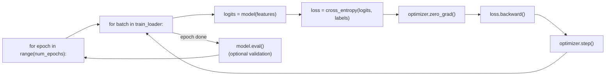

# 7. A typical training loop

!!! abstract "Notebook / Script"
    [`notebooks/06_training_loop.ipynb`](https://github.com/sourangshupal/pytorch-primer/blob/main/notebooks/06_training_loop.ipynb) ·
    [`scripts/06_training_loop.py`](https://github.com/sourangshupal/pytorch-primer/blob/main/scripts/06_training_loop.py) ·
    See also: [Track 2 — Optimization Loop](../track2-official/16-optimization-loop.md)

We now have everything needed to train a neural network: the tensor library, autograd,
`nn.Module`, and data loaders. Let's combine them.

This cell rebuilds the model + toy dataset from the previous notebooks so this notebook is
self-contained.

```python
import torch
import torch.nn.functional as F
from torch.utils.data import Dataset, DataLoader


class NeuralNetwork(torch.nn.Module):
    def __init__(self, num_inputs, num_outputs):
        super().__init__()
        self.layers = torch.nn.Sequential(
            torch.nn.Linear(num_inputs, 30),
            torch.nn.ReLU(),
            torch.nn.Linear(30, 20),
            torch.nn.ReLU(),
            torch.nn.Linear(20, num_outputs),
        )

    def forward(self, x):
        return self.layers(x)


class ToyDataset(Dataset):
    def __init__(self, X, y):
        self.features = X
        self.labels = y

    def __getitem__(self, index):
        return self.features[index], self.labels[index]

    def __len__(self):
        return self.labels.shape[0]


X_train = torch.tensor([[-1.2, 3.1], [-0.9, 2.9], [-0.5, 2.6], [2.3, -1.1], [2.7, -1.5]])
y_train = torch.tensor([0, 0, 0, 1, 1])
X_test = torch.tensor([[-0.8, 2.8], [2.6, -1.6]])
y_test = torch.tensor([0, 1])

train_loader = DataLoader(ToyDataset(X_train, y_train), batch_size=2, shuffle=True,
                           num_workers=0, drop_last=True)
test_loader = DataLoader(ToyDataset(X_test, y_test), batch_size=2, shuffle=False, num_workers=0)
```

## The training loop



```python
torch.manual_seed(123)
model = NeuralNetwork(num_inputs=2, num_outputs=2)
optimizer = torch.optim.SGD(model.parameters(), lr=0.5)

num_epochs = 3

for epoch in range(num_epochs):

    model.train()
    for batch_idx, (features, labels) in enumerate(train_loader):

        logits = model(features)
        loss = F.cross_entropy(logits, labels)  # softmax applied internally

        optimizer.zero_grad()   # reset gradients - otherwise they accumulate
        loss.backward()         # compute gradients (autograd)
        optimizer.step()        # update parameters using the gradients

        print(f"Epoch: {epoch+1:03d}/{num_epochs:03d}"
              f" | Batch {batch_idx:03d}/{len(train_loader):03d}"
              f" | Train/Val Loss: {loss:.2f}")

    model.eval()
    # Optional model evaluation would go here
```

Loss should reach (near) zero after 3 epochs — the model has converged on this tiny dataset.
Walking through the new pieces:

- **`lr=0.5`** (learning rate) and **`num_epochs`** are hyperparameters you tune by watching the
  loss. In practice you'd use a held-out **validation set** (distinct from the test set, which
  should only be touched once) to tune these.
- **`model.train()` / `model.eval()`** put the model in training/inference mode. Our model has no
  dropout or batch-norm layers, so this is a no-op here — but it's best practice to always include
  it, so your code doesn't silently misbehave if you later add such layers.
- **`optimizer.zero_grad()`** must be called every step, or gradients accumulate across batches
  (sometimes desirable for large-batch simulation via gradient accumulation, but not the default
  you want).

## Evaluating the trained model

```python
model.eval()
with torch.no_grad():
    outputs = model(X_train)
print(outputs)
```

```python
torch.set_printoptions(sci_mode=False)
probas = torch.softmax(outputs, dim=1)
print(probas)
```

```python
predictions = torch.argmax(probas, dim=1)
print(predictions)

# You don't actually need softmax to get the predicted class - argmax on the
# raw logits gives the identical answer, since softmax is monotonic:
predictions = torch.argmax(outputs, dim=1)
print(predictions)
```

```python
print(predictions == y_train)
print(torch.sum(predictions == y_train), "/", len(y_train), "correct")
```

Generalize this into a reusable accuracy function that works over an entire `DataLoader`
(important once a dataset is too large to fit in memory in one call):

```python
def compute_accuracy(model, dataloader):
    model.eval()
    correct = 0.0
    total_examples = 0

    for features, labels in dataloader:
        with torch.no_grad():
            logits = model(features)
        predictions = torch.argmax(logits, dim=1)
        compare = labels == predictions
        correct += torch.sum(compare)
        total_examples += len(compare)

    return (correct / total_examples).item()


print("Train accuracy:", compute_accuracy(model, train_loader))
print("Test accuracy:", compute_accuracy(model, test_loader))
```

**Next:** [8. Saving and loading models](07-saving-loading.md)
