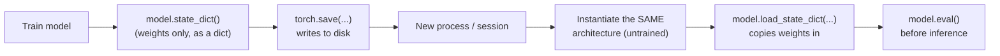

# 8. Saving and loading models

!!! abstract "Notebook / Script"
    [`notebooks/07_saving_and_loading_models.ipynb`](https://github.com/sourangshupal/pytorch-primer/blob/main/notebooks/07_saving_and_loading_models.ipynb) ·
    [`scripts/07_saving_and_loading_models.py`](https://github.com/sourangshupal/pytorch-primer/blob/main/scripts/07_saving_and_loading_models.py) ·
    See also: [Track 2 — Save/Load and Predict](../track2-official/17-save-load-predict.md)

Once trained, you'll usually want to persist a model so you don't have to retrain it. PyTorch's
recommended approach saves the model's `state_dict` — a plain Python dict mapping each layer name
to its learned weights/biases — rather than pickling the whole model object.

## 8.1 Saving just the weights (recommended)

The save/load cycle is a multi-step process that's easy to get backwards the first time you do it
— here's the whole flow before we touch any code:



The two steps people most often skip are **E** (you must build the architecture yourself before
loading into it — the file only contains numbers, not the class definition) and **G** (forgetting
`.eval()` leaves layers like `Dropout`/`BatchNorm` in training mode during inference, which
silently gives wrong predictions on some architectures — this notebook's tiny MLP has neither, but
flag it for whenever your own model does).

```python
import torch


class NeuralNetwork(torch.nn.Module):
    def __init__(self, num_inputs, num_outputs):
        super().__init__()
        self.layers = torch.nn.Sequential(
            torch.nn.Linear(num_inputs, 30),
            torch.nn.ReLU(),
            torch.nn.Linear(30, 20),
            torch.nn.ReLU(),
            torch.nn.Linear(20, num_outputs),
        )

    def forward(self, x):
        return self.layers(x)


torch.manual_seed(123)
model = NeuralNetwork(2, 2)

# Save just the learned parameters:
torch.save(model.state_dict(), "model.pth")
print("Saved model.state_dict() to model.pth")
```

`"model.pth"` is an arbitrary filename — `.pth` / `.pt` are just conventions. To restore the
model, first re-create an instance with the *exact same architecture*, then load the saved
parameters into it:

```python
model2 = NeuralNetwork(2, 2)  # architecture must match the original exactly

# weights_only=True is the safe, recommended default in modern PyTorch:
# it restricts unpickling to tensors/parameters only, guarding against
# arbitrary code execution from untrusted checkpoint files.
model2.load_state_dict(torch.load("model.pth", weights_only=True))
```

If you ran this in the same session where you trained the model, re-instantiating `model2` isn't
strictly necessary — it's shown here to make explicit that you need a model instance in memory
*before* you can apply saved parameters to it.

!!! danger "Security note"
    Always load checkpoints with `weights_only=True` (the current PyTorch default) unless you
    fully trust the source of the file — this is what protects you from a malicious `.pth` file
    executing arbitrary code during unpickling.

## 8.2 Common pitfall: architecture mismatch

The most common "why won't my checkpoint load" bug: the class you instantiate before loading
doesn't exactly match the architecture the weights were saved from. `load_state_dict` checks
shapes and names strictly — it fails loudly rather than silently loading garbage:

```python
# Deliberately wrong architecture: 3 outputs instead of the 2 the checkpoint was trained with.
mismatched_model = NeuralNetwork(num_inputs=2, num_outputs=3)
mismatched_model.load_state_dict(torch.load("model.pth", weights_only=True))
# RuntimeError: size mismatch for layers.4.weight: copying a param with shape
# torch.Size([2, 20]) from checkpoint, the shape in current model is torch.Size([3, 20]).
```

## 8.3 Loading a checkpoint across devices (`map_location`)

If you save a checkpoint on one device (say, a CUDA GPU on a training server) and later load it on
a machine without that device (your laptop's CPU, or a different accelerator), a plain
`torch.load` can fail or try to allocate on hardware that isn't there. `map_location` tells
`torch.load` which device to put the tensors on *as they're loaded*, independent of where they
were saved from:

```python
from utils.device import get_device

device = get_device()  # CUDA > MPS > CPU, whatever this machine has

model3 = NeuralNetwork(2, 2)
state_dict = torch.load("model.pth", weights_only=True, map_location=device)
model3.load_state_dict(state_dict)
model3.to(device)
```

**Next:** [9.1-9.2 GPU training](08-gpu-training.md)
