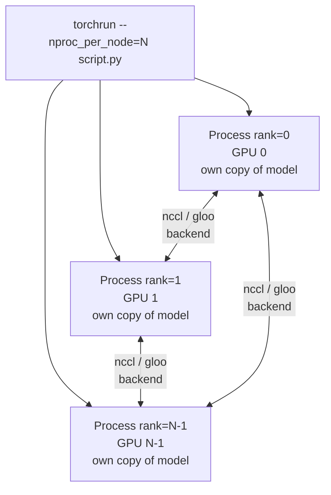
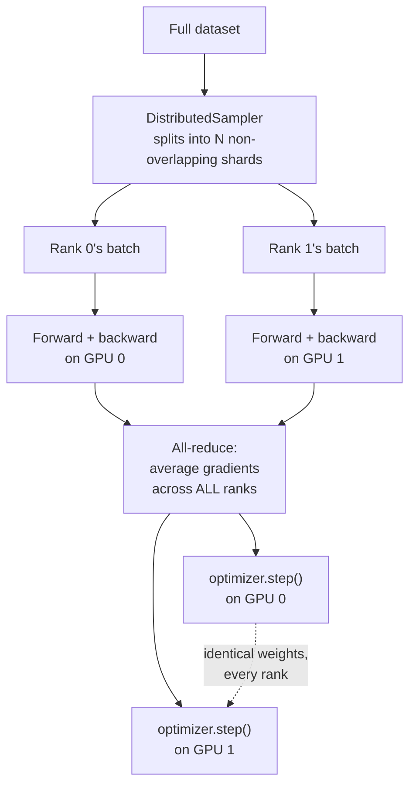

# 9.3 Training with multiple GPUs (DistributedDataParallel)

!!! abstract "Notebook / Script"
    [`notebooks/09_multi_gpu_ddp.ipynb`](https://github.com/sourangshupal/pytorch-primer/blob/main/notebooks/09_multi_gpu_ddp.ipynb) ·
    [`scripts/ddp_train.py`](https://github.com/sourangshupal/pytorch-primer/blob/main/scripts/ddp_train.py) (the runnable script) ·
    See also: [DDP Script Walkthrough](../ddp-script-walkthrough.md)

!!! warning "This is a guided code walkthrough, not something you run live in class"
    It requires 2+ CUDA GPUs and must run as a standalone script via `torchrun`, not inside a
    notebook/Jupyter kernel (DDP needs one independent Python process per GPU; Jupyter's
    multiprocessing model doesn't support that). Read this page for the concepts, then look at
    the [full annotated script](../ddp-script-walkthrough.md).

## Why distributed training?

Training on a single GPU/machine can be slow to iterate on, especially during experimentation.
**Distributed training** splits the work across multiple GPUs (and potentially multiple machines)
to cut training time roughly proportionally to the number of GPUs used.

We'll look at PyTorch's simplest strategy: **`DistributedDataParallel` (DDP)**.

## How DDP works

1. PyTorch launches one independent process **per GPU**.
2. Each process gets its own **copy of the model**.
3. A `DistributedSampler` splits the dataset so each GPU sees a different, non-overlapping subset
   (minibatch) each step.
4. Each process runs its own forward + backward pass independently → different gradients per GPU
   (since each saw different data).
5. Gradients are **averaged and synchronized** across all GPUs after the backward pass, so every
   model replica ends up with identical, updated weights — they never diverge.

Two GPUs → roughly half the time per epoch vs. one GPU (minus small communication overhead);
eight GPUs → roughly an eighth of the time, and so on.

### Process topology

`torchrun` starts one independent OS process per GPU. They don't share memory — everything they
need to agree on (gradients, in particular) has to be communicated explicitly over the network
backend (`nccl` for GPU-to-GPU, `gloo` as a portable fallback):



Each box is a full, independent Python interpreter running your entire script — this is why DDP
can't run inside a single Jupyter kernel: a kernel is one process, and DDP fundamentally needs
several.

## Key new pieces of API

Compared to the single-device script in [Notebook 8](08-gpu-training.md), DDP adds:

```python
import os
import platform
from torch.utils.data.distributed import DistributedSampler
from torch.nn.parallel import DistributedDataParallel as DDP
from torch.distributed import init_process_group, destroy_process_group
```

- **`DistributedSampler`**: divides the dataset across processes without overlap.
- **`init_process_group` / `destroy_process_group`**: set up and tear down the communication
  channel between processes (called once each, at the start/end of the script).
- **`DistributedDataParallel` (DDP)**: wraps your model so gradient synchronization across GPUs
  happens automatically during `.backward()`.

## `ddp_setup`: initializing the process group

Each process needs to know how to find the others (a "master" address/port) and which
communication backend to use — `nccl` (NVIDIA's GPU-to-GPU library) on Linux/CUDA, `gloo` as the
portable fallback (e.g. on Windows).

```python
def ddp_setup(rank, world_size):
    """
    rank: this process's unique ID (0, 1, 2, ...)
    world_size: total number of processes (== number of GPUs in use)
    """
    if "MASTER_ADDR" not in os.environ:
        os.environ["MASTER_ADDR"] = "localhost"
    if "MASTER_PORT" not in os.environ:
        os.environ["MASTER_PORT"] = "12345"

    if platform.system() == "Windows":
        os.environ["USE_LIBUV"] = "0"
        init_process_group(backend="gloo", rank=rank, world_size=world_size)
    else:
        init_process_group(backend="nccl", rank=rank, world_size=world_size)

    torch.cuda.set_device(rank)
```

## Wiring it into the training loop

### Per-epoch data flow

Putting `DistributedSampler`, the per-rank forward/backward pass, and gradient synchronization
together, one training step looks like this:



The all-reduce step is what `loss.backward()` triggers automatically once the model is wrapped in
`DDP` — it's the one place where the otherwise-independent processes must actually talk to each
other every single step.

Inside `main(rank, world_size, num_epochs)` (see [DDP Script Walkthrough](../ddp-script-walkthrough.md)
for the complete, runnable file):

```python
model.to(rank)
model = DDP(model, device_ids=[rank])   # wrap AFTER moving to device

train_loader.sampler.set_epoch(epoch)    # reshuffle differently each epoch

for features, labels in train_loader:
    features, labels = features.to(rank), labels.to(rank)
    logits = model(features)
    loss = F.cross_entropy(logits, labels)
    optimizer.zero_grad()
    loss.backward()      # DDP synchronizes gradients across GPUs here
    optimizer.step()
```

## Launching it: `torchrun`, not `python`

DDP scripts are launched with PyTorch's `torchrun` utility (installed automatically with PyTorch),
which spawns one process per GPU and injects `RANK` / `WORLD_SIZE` / `LOCAL_RANK` environment
variables that the script reads at startup:

```bash
# Run on exactly 2 GPUs:
torchrun --nproc_per_node=2 scripts/ddp_train.py

# Run on every GPU available on this machine:
torchrun --nproc_per_node=$(nvidia-smi -L | wc -l) scripts/ddp_train.py
```

## One gotcha: duplicated print output

Since every process runs the full script independently, a naive `print("Test accuracy:", acc)`
inside the eval loop prints once *per GPU* — you'll see the same line N times for N GPUs. Fix it by
only printing from rank 0:

```python
if rank == 0:
    print("Test accuracy:", accuracy)
```

## Beyond DDP: FSDP

DDP replicates the *entire* model on every GPU — great when a model fits comfortably in one GPU's
memory. For models too large for a single GPU, PyTorch's **Fully Sharded Data Parallel (FSDP)**
shards the model itself (not just the data) across GPUs. See:
[Introducing PyTorch Fully Sharded Data Parallel API](https://pytorch.org/blog/introducing-pytorch-fully-sharded-data-parallel-api/).

**Next step:** read the [DDP Script Walkthrough](../ddp-script-walkthrough.md) for the full,
runnable, annotated script — or move on to [Track 2](../track2-official/10-quickstart.md) to see
this whole primer's concepts applied to a real dataset end to end.
