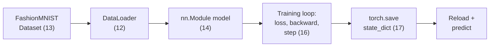

# 10. Official PyTorch Quickstart (end-to-end, real dataset)

*Adapted from the official [PyTorch "Learn the Basics" — Quickstart](https://docs.pytorch.org/tutorials/beginner/basics/quickstart_tutorial.html) tutorial.*

!!! abstract "Notebook"
    [`notebooks/10_official_quickstart.ipynb`](https://github.com/sourangshupal/pytorch-primer/blob/main/notebooks/10_official_quickstart.ipynb) ·
    Complements: all of [Track 1](../track1-raschka/01-what-is-pytorch.md)

[Track 1](../track1-raschka/01-what-is-pytorch.md) (adapted from Sebastian Raschka's *PyTorch in
One Hour*) builds every concept from small, hand-written toy tensors. This notebook is the
complementary **end-to-end walkthrough on a real dataset** (FashionMNIST) — useful as a
single-glance "here's the whole pipeline" reference, and as the entry point into
[Notebooks 11-17](11-tensors-deep-dive.md), which each go deeper into one part of this pipeline
(tensors, datasets, transforms, models, autograd, optimization, saving).

### The whole pipeline, in one picture



The rest of this page walks left to right through this diagram once; Notebooks 11-17 each zoom
into one box.

## Working with data

`Dataset` stores samples + labels; `DataLoader` wraps an iterable around a `Dataset` (batching,
shuffling, parallel loading).

```python
import torch
from torch import nn
from torch.utils.data import DataLoader
from torchvision import datasets
from torchvision.transforms import v2

# Download training/test data from the open FashionMNIST dataset.
# v2.ToImage() + v2.ToDtype(..., scale=True) is the modern replacement for the
# legacy `transforms.ToTensor()`: it converts a PIL image to a tensor and
# scales pixel values to [0, 1] as float32.
training_data = datasets.FashionMNIST(
    root="data",
    train=True,
    download=True,
    transform=v2.Compose([v2.ToImage(), v2.ToDtype(torch.float32, scale=True)]),
)

test_data = datasets.FashionMNIST(
    root="data",
    train=False,
    download=True,
    transform=v2.Compose([v2.ToImage(), v2.ToDtype(torch.float32, scale=True)]),
)
```

```python
batch_size = 64

train_dataloader = DataLoader(training_data, batch_size=batch_size)
test_dataloader = DataLoader(test_data, batch_size=batch_size)

for X, y in test_dataloader:
    print(f"Shape of X [N, C, H, W]: {X.shape}")
    print(f"Shape of y: {y.shape} {y.dtype}")
    break
```

## Creating models

Same `nn.Module` pattern as [Notebook 4](../track1-raschka/04-neural-networks.md), applied to real
28x28 grayscale images (flattened to 784 features). Note the **`torch.accelerator`** API used for
device selection — the modern, unified way to detect CUDA/MPS/XPU/MTIA in a single call (see
[Hardware Detection](../hardware-detection.md), which wraps this same logic with a CPU fallback
for consistency across this whole primer).

```python
import sys, os
sys.path.append(os.path.abspath(".."))
from utils.device import print_hardware_report

device = print_hardware_report()

class NeuralNetwork(nn.Module):
    def __init__(self):
        super().__init__()
        self.flatten = nn.Flatten()
        self.linear_relu_stack = nn.Sequential(
            nn.Linear(28 * 28, 512),
            nn.ReLU(),
            nn.Linear(512, 512),
            nn.ReLU(),
            nn.Linear(512, 10),
        )

    def forward(self, x):
        x = self.flatten(x)
        return self.linear_relu_stack(x)

model = NeuralNetwork().to(device)
print(model)
```

## Optimizing model parameters

A loss function, an optimizer, and a train/test loop — the same three ingredients as
[Notebook 6](../track1-raschka/06-training-loop.md), now looped over real batches:

```python
loss_fn = nn.CrossEntropyLoss()
optimizer = torch.optim.SGD(model.parameters(), lr=1e-3)


def train(dataloader, model, loss_fn, optimizer):
    size = len(dataloader.dataset)
    model.train()
    for batch, (X, y) in enumerate(dataloader):
        X, y = X.to(device), y.to(device)

        pred = model(X)
        loss = loss_fn(pred, y)

        loss.backward()
        optimizer.step()
        optimizer.zero_grad()

        if batch % 100 == 0:
            loss, current = loss.item(), (batch + 1) * len(X)
            print(f"loss: {loss:>7f}  [{current:>5d}/{size:>5d}]")


def test(dataloader, model, loss_fn):
    size = len(dataloader.dataset)
    num_batches = len(dataloader)
    model.eval()
    test_loss, correct = 0, 0
    with torch.no_grad():
        for X, y in dataloader:
            X, y = X.to(device), y.to(device)
            pred = model(X)
            test_loss += loss_fn(pred, y).item()
            correct += (pred.argmax(1) == y).type(torch.float).sum().item()
    test_loss /= num_batches
    correct /= size
    print(f"Test Error: \n Accuracy: {(100*correct):>0.1f}%, Avg loss: {test_loss:>8f} \n")
```

```python
epochs = 5
for t in range(epochs):
    print(f"Epoch {t+1}\n-------------------------------")
    train(train_dataloader, model, loss_fn, optimizer)
    test(test_dataloader, model, loss_fn)
print("Done!")
```

## Saving and loading, then using the model to predict

```python
torch.save(model.state_dict(), "model.pth")
print("Saved PyTorch Model State to model.pth")

model = NeuralNetwork().to(device)
model.load_state_dict(torch.load("model.pth", weights_only=True))
```

```python
classes = [
    "T-shirt/top", "Trouser", "Pullover", "Dress", "Coat",
    "Sandal", "Shirt", "Sneaker", "Bag", "Ankle boot",
]

model.eval()
x, y = test_data[0][0], test_data[0][1]
with torch.no_grad():
    x = x.to(device)
    pred = model(x)
    predicted, actual = classes[pred[0].argmax(0)], classes[y]
    print(f'Predicted: "{predicted}", Actual: "{actual}"')
```

That's the entire pipeline in one notebook. Where to go deeper on each piece:

- **Tensors** → [Notebook 2](../track1-raschka/02-tensors.md) (basics) and
  [Notebook 11](11-tensors-deep-dive.md) (indexing, NumPy bridge, in-place ops)
- **Datasets & DataLoaders** → [Notebook 5](../track1-raschka/05-data-loaders.md) and
  [Notebook 12](12-datasets-dataloaders.md)
- **Transforms** → [Notebook 13](13-transforms.md)
- **Building models** → [Notebook 4](../track1-raschka/04-neural-networks.md) and
  [Notebook 14](14-build-model-deep-dive.md)
- **Autograd** → [Notebook 3](../track1-raschka/03-autograd.md) and
  [Notebook 15](15-autograd-deep-dive.md)
- **Optimization loop** → [Notebook 6](../track1-raschka/06-training-loop.md) and
  [Notebook 16](16-optimization-loop.md)
- **Save/load/predict** → [Notebook 7](../track1-raschka/07-saving-loading.md) and
  [Notebook 17](17-save-load-predict.md)
- **GPU/multi-GPU** → [Notebook 8](../track1-raschka/08-gpu-training.md),
  [Notebook 9](../track1-raschka/09-multi-gpu-ddp.md)
