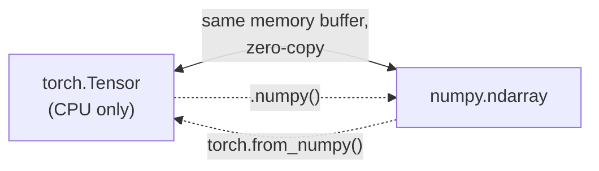

# 11. Tensors — deep dive

*Adapted from the official [PyTorch Tensors](https://docs.pytorch.org/tutorials/beginner/basics/tensorqs_tutorial.html) tutorial.*

!!! abstract "Notebook"
    [`notebooks/11_official_tensors_deep_dive.ipynb`](https://github.com/sourangshupal/pytorch-primer/blob/main/notebooks/11_official_tensors_deep_dive.ipynb) ·
    Complements: [Track 1 — Tensors](../track1-raschka/02-tensors.md)

Complements [Notebook 2](../track1-raschka/02-tensors.md), which covers the essentials from
Raschka's primer — this notebook adds the extra initialization patterns, indexing/slicing, and
the NumPy interop that the official tutorial covers and the blog doesn't.

## Initializing a tensor — more ways than `torch.tensor(...)`

```python
import torch
import numpy as np

# Directly from data (dtype inferred automatically)
data = [[1, 2], [3, 4]]
x_data = torch.tensor(data)

# From a NumPy array
np_array = np.array(data)
x_np = torch.from_numpy(np_array)

# From another tensor: retains shape/dtype unless overridden
x_ones = torch.ones_like(x_data)               # keeps x_data's properties
x_rand = torch.rand_like(x_data, dtype=torch.float)  # overrides the dtype

print("x_ones:\n", x_ones)
print("x_rand:\n", x_rand)
```

```python
# With a given shape (constant or random values)
shape = (2, 3)
rand_tensor = torch.rand(shape)
ones_tensor = torch.ones(shape)
zeros_tensor = torch.zeros(shape)

print("Random:\n", rand_tensor)
print("Ones:\n", ones_tensor)
print("Zeros:\n", zeros_tensor)
```

## Attributes of a tensor

```python
tensor = torch.rand(3, 4)
print(f"Shape of tensor: {tensor.shape}")
print(f"Datatype of tensor: {tensor.dtype}")
print(f"Device tensor is stored on: {tensor.device}")
```

## Operations on tensors

PyTorch has 1200+ tensor ops (full list: <https://pytorch.org/docs/stable/torch.html>). All run on
CPU or an accelerator (CUDA/MPS/XPU/MTIA). Tensors are created on CPU by default — move explicitly
with `.to(device)`, using [`utils/device.py`](../hardware-detection.md)'s `get_device()` for the
modern, backend-agnostic check.

```python
import sys, os
sys.path.append(os.path.abspath(".."))
from utils.device import get_device

device = get_device()
tensor = tensor.to(device)
print("moved to:", tensor.device)
```

**NumPy-style indexing and slicing:**

```python
tensor = torch.ones(4, 4)
print(f"First row: {tensor[0]}")
print(f"First column: {tensor[:, 0]}")
print(f"Last column: {tensor[..., -1]}")
tensor[:, 1] = 0
print(tensor)
```

**Joining tensors** with `torch.cat` (see also `torch.stack`, which adds a new dimension instead
of concatenating along an existing one):

```python
t1 = torch.cat([tensor, tensor, tensor], dim=1)
print(t1)
```

**Arithmetic**: matrix multiplication and element-wise product each have two equivalent spellings:

```python
# Matrix multiplication - y1, y2, y3 are identical
y1 = tensor @ tensor.T
y2 = tensor.matmul(tensor.T)
y3 = torch.rand_like(y1)
torch.matmul(tensor, tensor.T, out=y3)

# Element-wise product - z1, z2, z3 are identical
z1 = tensor * tensor
z2 = tensor.mul(tensor)
z3 = torch.rand_like(tensor)
torch.mul(tensor, tensor, out=z3)

print(y1)
print(z1)
```

**Single-element tensors**: pull a Python number out with `.item()` (common after `.sum()`,
`.mean()`, computing a scalar loss, etc.):

```python
agg = tensor.sum()
agg_item = agg.item()
print(agg_item, type(agg_item))
```

**In-place operations** (suffixed with `_`, e.g. `tensor.add_(5)`, `x.copy_(y)`, `x.t_()`) modify
the tensor in place instead of returning a new one.

!!! warning "Use sparingly"
    In-place ops save memory but immediately lose the history autograd needs — they can silently
    break gradient computation. Prefer the non-in-place form unless you have a specific reason
    (e.g. optimizer internals) and know what you're doing.

```python
print(tensor, "\n")
tensor.add_(5)
print(tensor)
```

## Bridge with NumPy

CPU tensors and NumPy arrays can **share the same underlying memory** — converting between them is
free, and mutating one mutates the other.



This shared-memory trick only applies to **CPU** tensors — a GPU/MPS tensor has no NumPy
equivalent to share memory with, so `.numpy()` on an accelerator tensor requires an explicit
`.cpu()` first (a real copy, not free).

```python
t = torch.ones(5)
n = t.numpy()
print(f"t: {t}")
print(f"n: {n}")

t.add_(1)          # in-place change to the tensor...
print(f"t: {t}")
print(f"n: {n}")   # ...is reflected in the NumPy array too
```

```python
n = np.ones(5)
t = torch.from_numpy(n)

np.add(n, 1, out=n)  # change to the NumPy array...
print(f"t: {t}")
print(f"n: {n}")      # ...is reflected in the tensor too
```
