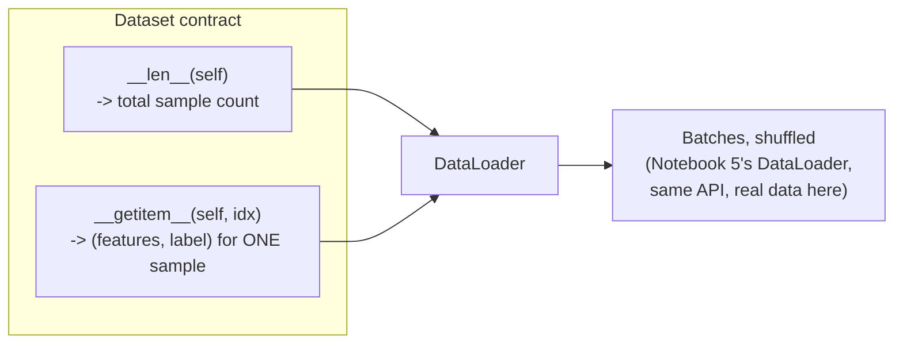

# 12. Datasets & DataLoaders — real data and custom file-backed datasets

*Adapted from the official [Datasets & DataLoaders](https://docs.pytorch.org/tutorials/beginner/basics/data_tutorial.html) tutorial.*

!!! abstract "Notebook"
    [`notebooks/12_official_datasets_and_dataloaders.ipynb`](https://github.com/sourangshupal/pytorch-primer/blob/main/notebooks/12_official_datasets_and_dataloaders.ipynb) ·
    Complements: [Track 1 — Data Loaders](../track1-raschka/05-data-loaders.md)

Complements [Notebook 5](../track1-raschka/05-data-loaders.md), which builds a `Dataset`/
`DataLoader` from small in-memory tensors (Raschka's approach) — this notebook shows the two
things that primer doesn't: loading a real pre-built dataset from `torchvision`, and writing a
custom `Dataset` backed by files on disk.



Every `Dataset` on this page — the in-memory `ToyDataset` (Notebook 5), the built-in
`FashionMNIST` below, and the custom file-backed one further down — implements exactly these two
methods. `DataLoader` never needs to know which kind it's talking to.

## Loading a built-in dataset

`torchvision`, `torchtext`, and `torchaudio` each ship pre-loaded datasets that subclass
`torch.utils.data.Dataset` — handy for prototyping without writing any loading code yourself. Here
we load FashionMNIST (60,000 training + 10,000 test 28x28 grayscale images, 10 classes).

```python
import torch
from torch.utils.data import Dataset
from torchvision import datasets
from torchvision.transforms import v2
import matplotlib.pyplot as plt

training_data = datasets.FashionMNIST(
    root="data",
    train=True,
    download=True,
    transform=v2.Compose([v2.ToImage(), v2.ToDtype(torch.float32, scale=True)]),
)

test_data = datasets.FashionMNIST(
    root="data",
    train=False,
    download=True,
    transform=v2.Compose([v2.ToImage(), v2.ToDtype(torch.float32, scale=True)]),
)
```

## Iterating and visualizing

A `Dataset` can be indexed directly like a list: `training_data[index]` → `(image, label)`.

```python
labels_map = {
    0: "T-Shirt", 1: "Trouser", 2: "Pullover", 3: "Dress", 4: "Coat",
    5: "Sandal", 6: "Shirt", 7: "Sneaker", 8: "Bag", 9: "Ankle Boot",
}
figure = plt.figure(figsize=(8, 8))
cols, rows = 3, 3
for i in range(1, cols * rows + 1):
    sample_idx = torch.randint(len(training_data), size=(1,)).item()
    img, label = training_data[sample_idx]
    figure.add_subplot(rows, cols, i)
    plt.title(labels_map[label])
    plt.axis("off")
    plt.imshow(img.squeeze(), cmap="gray")
plt.show()
```

## Creating a custom `Dataset` for your own files

The FashionMNIST loader above hides all the file-handling logic. This is what it looks like if you
write it yourself for a directory of image files plus a CSV of labels:

```text
img_dir/tshirt1.jpg, tshirt2.jpg, ..., ankleboot999.jpg
annotations_file.csv:
    tshirt1.jpg, 0
    tshirt2.jpg, 0
    ...
    ankleboot999.jpg, 9
```

!!! note
    This cell is illustrative — it references files that don't exist in this repo, so don't run
    it as-is. Point it at your own `img_dir`/`annotations_file` to use it for real.

```python
import os
import pandas as pd
from torchvision.io import decode_image


class CustomImageDataset(Dataset):
    def __init__(self, annotations_file, img_dir, transform=None, target_transform=None):
        # Runs once, when the Dataset object is instantiated: store paths and
        # the two optional transform callables (see Notebook 13 for these).
        self.img_labels = pd.read_csv(annotations_file)
        self.img_dir = img_dir
        self.transform = transform
        self.target_transform = target_transform

    def __len__(self):
        # Total number of samples in the dataset.
        return len(self.img_labels)

    def __getitem__(self, idx):
        # Loads and returns exactly one (image, label) pair, given an index.
        img_path = os.path.join(self.img_dir, self.img_labels.iloc[idx, 0])
        image = decode_image(img_path)
        label = self.img_labels.iloc[idx, 1]
        if self.transform:
            image = self.transform(image)
        if self.target_transform:
            label = self.target_transform(label)
        return image, label
```

Same three methods as `ToyDataset` in [Notebook 5](../track1-raschka/05-data-loaders.md)
(`__init__`, `__len__`, `__getitem__`) — the only difference is *where the data comes from* (disk
+ CSV here, vs. in-memory tensors there). This is the general pattern for wiring up your own
image/text/audio dataset.

## Wrapping it in a `DataLoader`

Same API as Notebook 5 — here applied to the real FashionMNIST dataset instead of the toy one:

```python
from torch.utils.data import DataLoader

train_dataloader = DataLoader(training_data, batch_size=64, shuffle=True)
test_dataloader = DataLoader(test_data, batch_size=64, shuffle=True)

train_features, train_labels = next(iter(train_dataloader))
print(f"Feature batch shape: {train_features.size()}")
print(f"Labels batch shape: {train_labels.size()}")

img = train_features[0].squeeze()
label = train_labels[0]
plt.imshow(img, cmap="gray")
plt.show()
print(f"Label: {label}")
```

## A third pattern: `ImageFolder` for directory-per-class layouts

The CSV-backed `CustomImageDataset` above is fully general, but a very common special case doesn't
need a CSV at all: when images are already organized one subdirectory per class —

```text
img_dir/
    tshirt/    tshirt1.jpg, tshirt2.jpg, ...
    trouser/   trouser1.jpg, trouser2.jpg, ...
    ...
```

— `torchvision.datasets.ImageFolder` reads that structure directly and infers labels from the
subdirectory names, no custom `Dataset` subclass needed at all:

```python
from torchvision.datasets import ImageFolder

dataset = ImageFolder(root="img_dir", transform=my_transforms)
print(dataset.classes)        # inferred from subdirectory names, e.g. ['trouser', 'tshirt', ...]
print(dataset.class_to_idx)   # {'trouser': 0, 'tshirt': 1, ...} - alphabetical by default
```

!!! note
    Illustrative only — no such directory exists in this repo. Use it whenever your own images
    are already sorted into per-class folders; reach for `CustomImageDataset` instead when labels
    live in a separate file, as with FashionMNIST-style CSV annotations.
