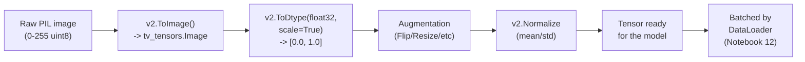

# 13. Transforms

*Adapted from the official [Transforms](https://docs.pytorch.org/tutorials/beginner/basics/transforms_tutorial.html) tutorial.*

!!! abstract "Notebook"
    [`notebooks/13_official_transforms.ipynb`](https://github.com/sourangshupal/pytorch-primer/blob/main/notebooks/13_official_transforms.ipynb) ·
    New topic — not covered in Track 1

This topic isn't in Raschka's primer at all — our toy tensors in Track 1 never needed
preprocessing — but it's essential once you work with real datasets like FashionMNIST
([Notebook 10](10-quickstart.md), [Notebook 12](12-datasets-dataloaders.md)).

Raw data rarely comes in the final form training needs. **Transforms** perform that preprocessing.
Every `torchvision` dataset takes two callables: `transform` (for the features/images) and
`target_transform` (for the labels).



## `ToImage()` and `ToDtype()`

FashionMNIST features arrive as PIL images; labels arrive as plain integers. For training we want
float tensors (normalized to [0, 1]) and, if we want one-hot labels, a small `Lambda` transform.

The modern `torchvision.transforms.v2` API splits what used to be a single `ToTensor()` call into
two explicit steps:

- **`v2.ToImage()`** converts a PIL image / NumPy array into a `torchvision.tv_tensors.Image`.
- **`v2.ToDtype(torch.float32, scale=True)`** casts to `float32` and rescales pixel values from
  `[0, 255]` to `[0.0, 1.0]`.

```python
import torch
import torch.nn.functional as F
from torchvision import datasets
from torchvision.transforms import v2

ds = datasets.FashionMNIST(
    root="data",
    train=True,
    download=True,
    transform=v2.Compose([v2.ToImage(), v2.ToDtype(torch.float32, scale=True)]),
    target_transform=v2.Lambda(
        lambda y: F.one_hot(torch.tensor(y), num_classes=10).float()
    ),
)

image, one_hot_label = ds[0]
print("image shape/dtype:", image.shape, image.dtype, "range:", image.min().item(), "-", image.max().item())
print("one-hot label:", one_hot_label)
```

## Lambda transforms

`v2.Lambda` wraps any user-defined function as a transform. Above we used
`torch.nn.functional.one_hot` to turn an integer class label (0-9) into a 10-element one-hot float
vector — matching the shape a loss function like `nn.MSELoss` would expect, as opposed to
`nn.CrossEntropyLoss`, which expects raw integer class indices (which is why
[Notebooks 6](../track1-raschka/06-training-loop.md)/[10](10-quickstart.md)/[16](16-optimization-loop.md)
in this primer *don't* one-hot-encode their labels — `cross_entropy` wants the plain integer form).

## Chaining geometric/augmentation transforms

In practice you'll almost always chain several transforms beyond just `ToImage`/`ToDtype` —
resizing, flipping for data augmentation, and normalizing:

```python
raw_ds = datasets.FashionMNIST(root="data", train=True, download=True)  # no transform: raw PIL
raw_image, _ = raw_ds[0]

augment_pipeline = v2.Compose([
    v2.Resize((32, 32)),                          # e.g. to match a model's expected input size
    v2.RandomHorizontalFlip(p=1.0),                # p=1.0 here only so the demo always flips
    v2.ToImage(),
    v2.ToDtype(torch.float32, scale=True),
    v2.Normalize(mean=[0.5], std=[0.5]),           # rescales [0,1] -> roughly [-1, 1]
])
augmented = augment_pipeline(raw_image)
```

## A custom transform as a callable class, vs. `v2.Lambda`

`v2.Lambda` is great for a one-off function, but for a transform with configuration (e.g. a
specific mean/std) a plain callable class is the more standard, reusable pattern in real projects:

```python
class NormalizeByStats:
    """Callable-class transform: reusable, configurable, no lambda needed."""
    def __init__(self, mean, std):
        self.mean = mean
        self.std = std

    def __call__(self, tensor):
        return (tensor - self.mean) / self.std


custom_normalize = NormalizeByStats(mean=0.5, std=0.5)
```

## Gotcha: `v2.Compose` order matters

Transforms run in the exact order you list them — swapping two steps can silently change the
result. A classic mistake: normalizing *before* the dtype/scale conversion instead of after:

```python
# Correct order: convert to image tensor, scale to [0,1], THEN normalize.
correct_pipeline = v2.Compose([
    v2.ToImage(),
    v2.ToDtype(torch.float32, scale=True),   # [0, 255] uint8 -> [0.0, 1.0] float
    v2.Normalize(mean=[0.5], std=[0.5]),      # [0.0, 1.0] -> roughly [-1, 1]
])

# WRONG order: Normalize BEFORE the dtype/scale conversion. Normalize expects a float
# tensor already in a known range — feeding it the raw uint8 image tensor errors outright.
wrong_pipeline = v2.Compose([
    v2.ToImage(),
    v2.Normalize(mean=[0.5], std=[0.5]),      # too early: still uint8 [0, 255] here
    v2.ToDtype(torch.float32, scale=True),
])
wrong_pipeline(raw_image)
# TypeError: Input tensor should be a float tensor. Got torch.uint8.
```

## Further reading

- [Getting started with transforms v2](https://pytorch.org/vision/stable/auto_examples/transforms/plot_transforms_getting_started.html)
- [torchvision.transforms.v2 API reference](https://pytorch.org/vision/stable/transforms.html#v2-api-reference-recommended)
