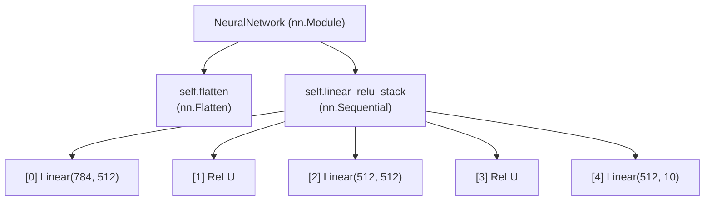

# 14. Build the Neural Network — deep dive

*Adapted from the official [Build the Neural Network](https://docs.pytorch.org/tutorials/beginner/basics/buildmodel_tutorial.html) tutorial.*

!!! abstract "Notebook"
    [`notebooks/14_official_build_model_deep_dive.ipynb`](https://github.com/sourangshupal/pytorch-primer/blob/main/notebooks/14_official_build_model_deep_dive.ipynb) ·
    Complements: [Track 1 — Building Neural Networks](../track1-raschka/04-neural-networks.md)

Complements [Notebook 4](../track1-raschka/04-neural-networks.md) — same `nn.Module` pattern as
the blog, but this notebook breaks down each layer type individually (`nn.Flatten`, `nn.Linear`,
`nn.ReLU`, `nn.Sequential`, `nn.Softmax`) on real image-shaped input, and shows the modern
`torch.accelerator` device API.

## Get a device for training

The unified `torch.accelerator` API (CUDA/MPS/XPU/MTIA in one call) is the modern replacement for
checking each backend by hand — this is exactly what [`utils/device.py`](../hardware-detection.md)
wraps for the rest of this primer:

```python
import sys, os
sys.path.append(os.path.abspath(".."))
import torch
from torch import nn
from utils.device import get_device

device = get_device()
print(f"Using {device} device")
```

## Define the class



`nn.Module`s nest arbitrarily — `linear_relu_stack` is itself a module (`nn.Sequential`) living
inside the outer `NeuralNetwork` module. `named_parameters()` walks this whole tree and gives each
leaf parameter a dotted name reflecting its position (e.g. `linear_relu_stack.0.weight`).

```python
class NeuralNetwork(nn.Module):
    def __init__(self):
        super().__init__()
        self.flatten = nn.Flatten()
        self.linear_relu_stack = nn.Sequential(
            nn.Linear(28 * 28, 512),
            nn.ReLU(),
            nn.Linear(512, 512),
            nn.ReLU(),
            nn.Linear(512, 10),
        )

    def forward(self, x):
        x = self.flatten(x)
        logits = self.linear_relu_stack(x)
        return logits


model = NeuralNetwork().to(device)
print(model)
```

!!! warning "Never call `model.forward(x)` directly"
    Always call `model(x)`, which runs some important bookkeeping around `forward` for you (hooks,
    etc.):

```python
X = torch.rand(1, 28, 28, device=device)
logits = model(X)
pred_probab = nn.Softmax(dim=1)(logits)
y_pred = pred_probab.argmax(1)
print(f"Predicted class: {y_pred}")
```

## Model layers, one at a time

Take a sample minibatch of 3 fake 28x28 images and trace it through each layer type.

```python
input_image = torch.rand(3, 28, 28)
print(input_image.size())
```

**`nn.Flatten`** collapses each 2D 28x28 image into a contiguous 784-length vector (keeping the
batch dimension at dim 0):

```python
flatten = nn.Flatten()
flat_image = flatten(input_image)
print(flat_image.size())   # torch.Size([3, 784])
```

**`nn.Linear`** applies a learned linear transformation (weights + bias):

```python
layer1 = nn.Linear(in_features=28 * 28, out_features=20)
hidden1 = layer1(flat_image)
print(hidden1.size())   # torch.Size([3, 20])
```

**`nn.ReLU`** (and other nonlinear activations) introduce nonlinearity between linear layers —
without it, stacking linear layers would collapse into a single linear layer, unable to model
complex relationships:

```python
print(f"Before ReLU: {hidden1}\n")
hidden1 = nn.ReLU()(hidden1)
print(f"After ReLU: {hidden1}")
```

**`nn.Sequential`** is an ordered container — data flows through each module in the order given,
letting you assemble a quick network without writing a custom `forward`:

```python
seq_modules = nn.Sequential(
    flatten,
    layer1,
    nn.ReLU(),
    nn.Linear(20, 10),
)
input_image = torch.rand(3, 28, 28)
logits = seq_modules(input_image)
print(logits.shape)
```

**`nn.Softmax`** scales raw logits (`[-inf, inf]`) to `[0, 1]` values that sum to 1 along `dim` —
interpretable class probabilities:

```python
softmax = nn.Softmax(dim=1)
pred_probab = softmax(logits)
print(pred_probab)
print(pred_probab.sum(dim=1))   # each row sums to ~1.0
```

## Model parameters

Subclassing `nn.Module` automatically tracks every parameter you declare, accessible via
`.parameters()` or `.named_parameters()`:

```python
print(f"Model structure: {model}\n")

for name, param in model.named_parameters():
    print(f"Layer: {name} | Size: {param.size()} | Values: {param[:2]}\n")
```
