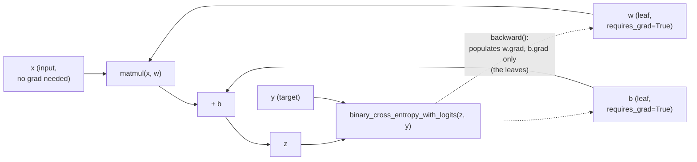

# 15. Automatic Differentiation with `torch.autograd` — deep dive

*Adapted from the official [Autograd](https://docs.pytorch.org/tutorials/beginner/basics/autogradqs_tutorial.html) tutorial.*

!!! abstract "Notebook"
    [`notebooks/15_official_autograd_deep_dive.ipynb`](https://github.com/sourangshupal/pytorch-primer/blob/main/notebooks/15_official_autograd_deep_dive.ipynb) ·
    Complements: [Track 1 — Computation Graphs & Autograd](../track1-raschka/03-autograd.md)

Complements [Notebook 3](../track1-raschka/03-autograd.md) (Raschka's logistic-regression example)
with the pieces the blog doesn't cover: `detach()`, why and how to disable gradient tracking, the
DAG's dynamic-graph behavior, and (optional/advanced) Jacobian products for non-scalar outputs.

## A one-layer network, as a computation graph



Same shape as [Notebook 3](../track1-raschka/03-autograd.md)'s graph, on a slightly larger
example — and the same rule: `.grad` only ever populates on the **leaves** (`w`, `b`), never on
intermediate nodes like `z` or `loss` itself.

```python
import torch

x = torch.ones(5)   # input tensor
y = torch.zeros(3)  # expected output
w = torch.randn(5, 3, requires_grad=True)
b = torch.randn(3, requires_grad=True)
z = torch.matmul(x, w) + b
loss = torch.nn.functional.binary_cross_entropy_with_logits(z, y)

print(f"Gradient function for z = {z.grad_fn}")
print(f"Gradient function for loss = {loss.grad_fn}")
```

`w` and `b` are the parameters we need to optimize, so both were created with `requires_grad=True`
(you can also set this later via `x.requires_grad_(True)`). Every tensor produced by an operation
on a `requires_grad=True` tensor carries a `grad_fn` — a reference to the function that knows how
to compute that operation's derivative during backpropagation.

## Computing gradients

```python
loss.backward()
print(w.grad)
print(b.grad)
```

Two important restrictions:

- You can only read `.grad` for **leaf nodes** with `requires_grad=True` (i.e. `w` and `b` here,
  not `z` or `loss`, which are intermediate/output nodes).
- You can only call `.backward()` **once** per graph by default (for performance — PyTorch frees
  the graph afterward). Pass `retain_graph=True` if you need multiple `.backward()` calls on the
  same graph (as in [Notebook 3](../track1-raschka/03-autograd.md), where we call `grad()` twice
  before `.backward()`).

## Disabling gradient tracking

By default, every operation on a `requires_grad=True` tensor is tracked. Once a model is trained
and you only want to run it forward (inference), tracking is pure overhead. Two ways to disable
it:

```python
z = torch.matmul(x, w) + b
print(z.requires_grad)   # True

with torch.no_grad():
    z = torch.matmul(x, w) + b
print(z.requires_grad)   # False
```

```python
z = torch.matmul(x, w) + b
z_det = z.detach()
print(z_det.requires_grad)   # False - same effect as no_grad(), for a single tensor
```

Reasons to disable gradient tracking:

- Marking some parameters as **frozen** (e.g. finetuning only the last few layers of a pretrained
  model).
- **Speed/memory**: forward-only computations are cheaper without graph bookkeeping — this is
  exactly why [Notebook 4](../track1-raschka/04-neural-networks.md),
  [Notebook 6](../track1-raschka/06-training-loop.md), and [Notebook 10](10-quickstart.md) in this
  primer wrap inference/eval code in `torch.no_grad()`.

## The graph is rebuilt every time (dynamic graphs)

PyTorch's autograd graph is a directed acyclic graph (DAG) of `Function` objects: leaves are input
tensors, roots are outputs. Each `.backward()` call walks it once, then autograd **throws the
graph away and rebuilds a fresh one on the next forward pass**. This is what lets you use ordinary
Python control flow (`if`, `for`, variable shapes) inside `forward` — the graph simply reflects
whatever path your code actually took that iteration, which static-graph frameworks can't do as
naturally.

## Optional / advanced: Jacobian products

!!! note "Skip this on a first read"
    Everything above assumes a **scalar** loss.

If a function's output is an *arbitrary tensor* `y = f(x)` instead, PyTorch can't compute a full
Jacobian matrix efficiently for you directly — instead it computes a **Jacobian product**
`v^T . J` for a vector `v` you supply, by passing `v` as the argument to `.backward(v)`:

```python
inp = torch.eye(4, 5, requires_grad=True)
out = (inp + 1).pow(2).t()

out.backward(torch.ones_like(out), retain_graph=True)
print(f"First call\n{inp.grad}")

out.backward(torch.ones_like(out), retain_graph=True)
print(f"\nSecond call\n{inp.grad}")   # note: gradients ACCUMULATE across backward() calls

inp.grad.zero_()   # this is exactly what optimizer.zero_grad() does for you
out.backward(torch.ones_like(out), retain_graph=True)
print(f"\nCall after zeroing gradients\n{inp.grad}")
```

That last cell is worth lingering on: gradients accumulate in `.grad` across every `.backward()`
call unless you explicitly zero them first. This is precisely why the training loops in
[Notebook 6](../track1-raschka/06-training-loop.md), [Notebook 8](../track1-raschka/08-gpu-training.md),
and [Notebook 10](10-quickstart.md) all call `optimizer.zero_grad()` at the start of every training
step.
