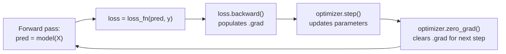

# 16. Optimizing Model Parameters — hyperparameters and the train/test loop

*Adapted from the official [Optimizing Model Parameters](https://docs.pytorch.org/tutorials/beginner/basics/optimization_tutorial.html) tutorial.*

!!! abstract "Notebook"
    [`notebooks/16_official_optimization_loop.ipynb`](https://github.com/sourangshupal/pytorch-primer/blob/main/notebooks/16_official_optimization_loop.ipynb) ·
    Complements: [Track 1 — Training Loop](../track1-raschka/06-training-loop.md)

Complements [Notebook 6](../track1-raschka/06-training-loop.md)'s toy-dataset training loop with:
explicit hyperparameter naming, a survey of common loss functions, and the `train_loop`/
`test_loop` function structure used throughout the official docs (also used in
[Notebook 10](10-quickstart.md)'s end-to-end example).

Training is iterative: each pass the model guesses, measures how wrong the guess was (the *loss*),
computes the derivative of that loss w.r.t. every parameter ([Notebook 15](15-autograd-deep-dive.md)),
and nudges the parameters to reduce the loss (gradient descent).

## Hyperparameters

Adjustable settings *you* choose (not learned by training) that control the optimization process:

- **Epochs** — how many full passes over the training dataset.
- **Batch size** — how many samples are propagated through the network before parameters update.
- **Learning rate** — how big a step to take at each update. Too small → slow convergence. Too
  large → unpredictable/divergent training.

```python
learning_rate = 1e-3
batch_size = 64
epochs = 5
```

## Loss functions

Common choices: `nn.MSELoss` (mean squared error, regression), `nn.NLLLoss` (negative
log-likelihood, classification), and `nn.CrossEntropyLoss` (combines `LogSoftmax` + `NLLLoss` —
this is what [Notebook 6](../track1-raschka/06-training-loop.md) and [Notebook 10](10-quickstart.md)
use, since it expects raw logits + integer class labels directly, no manual softmax or one-hot
encoding needed).

```python
import torch
from torch import nn

loss_fn = nn.CrossEntropyLoss()
```

## Optimizer

All optimization logic (how to use gradients to update parameters) lives in an `optimizer` object.
We use SGD here; PyTorch also ships Adam, RMSProp, and others suited to different models/data
(<https://pytorch.org/docs/stable/optim.html>). Three steps happen inside every training iteration:

1. `optimizer.zero_grad()` — reset gradients (they accumulate by default; see
   [Notebook 15](15-autograd-deep-dive.md)'s last cell).
2. `loss.backward()` — backpropagate, populating `.grad` on each parameter.
3. `optimizer.step()` — adjust parameters using those gradients.



```python
# Illustrative model matching Notebook 14's architecture - substitute your own.
model = nn.Sequential(
    nn.Flatten(),
    nn.Linear(28 * 28, 512), nn.ReLU(),
    nn.Linear(512, 512), nn.ReLU(),
    nn.Linear(512, 10),
)
optimizer = torch.optim.SGD(model.parameters(), lr=learning_rate)
```

## Full implementation: `train_loop` and `test_loop`

This is the exact function structure the official PyTorch docs (and Notebook 10's Quickstart) use
everywhere — worth memorizing the shape of it:

```python
def train_loop(dataloader, model, loss_fn, optimizer):
    size = len(dataloader.dataset)
    # Training mode matters once you add dropout/batch-norm layers (see Notebook 6).
    model.train()
    for batch, (X, y) in enumerate(dataloader):
        pred = model(X)
        loss = loss_fn(pred, y)

        loss.backward()
        optimizer.step()
        optimizer.zero_grad()

        if batch % 100 == 0:
            loss, current = loss.item(), batch * batch_size + len(X)
            print(f"loss: {loss:>7f}  [{current:>5d}/{size:>5d}]")


def test_loop(dataloader, model, loss_fn):
    model.eval()
    size = len(dataloader.dataset)
    num_batches = len(dataloader)
    test_loss, correct = 0, 0

    with torch.no_grad():
        for X, y in dataloader:
            pred = model(X)
            test_loss += loss_fn(pred, y).item()
            correct += (pred.argmax(1) == y).type(torch.float).sum().item()

    test_loss /= num_batches
    correct /= size
    print(f"Test Error: \n Accuracy: {(100*correct):>0.1f}%, Avg loss: {test_loss:>8f} \n")
```

Wire these up against real `train_dataloader`/`test_dataloader` objects (see
[Notebook 10](10-quickstart.md) or [Notebook 12](12-datasets-dataloaders.md)) and loop over
`epochs`:

```python
for t in range(epochs):
    print(f"Epoch {t+1}\n-------------------------------")
    train_loop(train_dataloader, model, loss_fn, optimizer)
    test_loop(test_dataloader, model, loss_fn)
print("Done!")
```

See [Notebook 10 — Quickstart](10-quickstart.md) for this exact loop running against real
FashionMNIST data.

## Optimizer choice matters: SGD vs. Adam on the same problem

"Different optimizers suited to different models/data" is easy to skim past. Make it concrete:
same tiny model, same toy dataset, same learning rate, same number of steps — only the optimizer
class differs.

```python
import torch.nn.functional as F

X_toy = torch.tensor([[-1.2, 3.1], [-0.9, 2.9], [-0.5, 2.6], [2.3, -1.1], [2.7, -1.5]])
y_toy = torch.tensor([0, 0, 0, 1, 1])


def train_n_steps(optimizer_cls, lr, steps=100):
    torch.manual_seed(0)  # same starting weights for a fair comparison
    tiny_model = nn.Sequential(nn.Linear(2, 8), nn.ReLU(), nn.Linear(8, 2))
    optimizer = optimizer_cls(tiny_model.parameters(), lr=lr)

    for _ in range(steps):
        logits = tiny_model(X_toy)
        loss = F.cross_entropy(logits, y_toy)
        optimizer.zero_grad()
        loss.backward()
        optimizer.step()
    return loss.item()


sgd_final_loss = train_n_steps(torch.optim.SGD, lr=0.1)
adam_final_loss = train_n_steps(torch.optim.Adam, lr=0.1)
# SGD  final loss (lr=0.1, 100 steps):  ~0.0071
# Adam final loss (lr=0.1, 100 steps):  ~0.0000
```

!!! note
    This result is specific to this toy problem and hyperparameters — don't conclude "Adam always
    wins." Adam's adaptive per-parameter learning rates often converge faster here, but SGD
    (especially with momentum) remains extremely competitive and sometimes generalizes better on
    large-scale training.
