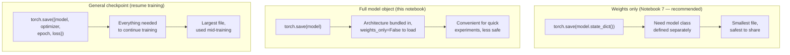

# 17. Save, Load, and Use the Model — the rest of the story

*Adapted from the official [Save and Load the Model](https://docs.pytorch.org/tutorials/beginner/basics/saveloadrun_tutorial.html) tutorial.*

!!! abstract "Notebook"
    [`notebooks/17_official_save_load_and_predict.ipynb`](https://github.com/sourangshupal/pytorch-primer/blob/main/notebooks/17_official_save_load_and_predict.ipynb) ·
    Complements: [Track 1 — Saving and Loading Models](../track1-raschka/07-saving-loading.md)

[Notebook 7](../track1-raschka/07-saving-loading.md) already covers the recommended `state_dict`
save/load pattern (from Raschka's primer) — this notebook adds the two things that tutorial
doesn't: saving a model's *architecture* along with its weights, and using a restored model to
make a labeled prediction.

### Three checkpoint styles, side by side



Pick weights-only by default; reach for the other two only when you specifically need what they
offer.

## Recap: saving/loading weights only (the recommended approach)

[Notebook 7](../track1-raschka/07-saving-loading.md) covers this in full — the short version:

```python
torch.save(model.state_dict(), "model_weights.pth")

model2 = NeuralNetwork()  # must re-create the architecture first
model2.load_state_dict(torch.load("model_weights.pth", weights_only=True))
model2.eval()  # IMPORTANT before inference - see note below
```

!!! warning "Don't skip `model.eval()` before inference"
    It's not just a style convention — it puts dropout and batch-norm layers into inference mode.
    Skipping it gives inconsistent predictions for any model that uses those layers, even though
    our tiny toy MLP in Notebook 7 doesn't.

## Saving the architecture *with* the weights

`load_state_dict` requires you to already have an instance of the right model class in memory —
useful, but it means the class definition must always travel with the weights file separately. If
you'd rather bundle the architecture into the saved file itself, pass the whole `model` (not
`model.state_dict()`) to `torch.save`:

```python
class NeuralNetwork(torch.nn.Module):
    def __init__(self, num_inputs=2, num_outputs=2):
        super().__init__()
        self.layers = torch.nn.Sequential(
            torch.nn.Linear(num_inputs, 30), torch.nn.ReLU(),
            torch.nn.Linear(30, 20), torch.nn.ReLU(),
            torch.nn.Linear(20, num_outputs),
        )

    def forward(self, x):
        return self.layers(x)


model = NeuralNetwork()

# Save the WHOLE model object (architecture + weights), not just state_dict():
torch.save(model, "model_with_shapes.pth")
```

Loading it back needs no prior model instance:

```python
restored_model = torch.load("model_with_shapes.pth", weights_only=False)
restored_model.eval()
```

!!! danger "Security note"
    This form uses Python's `pickle` under the hood and needs `weights_only=False`, because
    unpickling a full object graph (not just tensors) requires running arbitrary code paths from
    the class definition. Only do this with files you trust completely — `weights_only=True` (the
    default we use everywhere else in this primer) is the safer choice and is what the PyTorch
    docs themselves recommend as best practice. Reach for this form only when you specifically
    need the architecture bundled with the weights (e.g. quick experiments, not production
    checkpoints).

## Using a restored model to predict, with human-readable labels

The piece Notebook 7 stops short of: turning a raw prediction back into a class name. Self-contained
below — it builds its own tiny model and reloads FashionMNIST rather than assuming Notebook 10/14
state:

```python
import torchvision
from torchvision.transforms import v2

classes = [
    "T-shirt/top", "Trouser", "Pullover", "Dress", "Coat",
    "Sandal", "Shirt", "Sneaker", "Bag", "Ankle boot",
]


class FashionModel(torch.nn.Module):
    def __init__(self):
        super().__init__()
        self.flatten = torch.nn.Flatten()
        self.layers = torch.nn.Sequential(
            torch.nn.Linear(28 * 28, 128), torch.nn.ReLU(),
            torch.nn.Linear(128, 10),
        )

    def forward(self, x):
        return self.layers(self.flatten(x))


test_data = torchvision.datasets.FashionMNIST(
    root="data", train=False, download=True,
    transform=v2.Compose([v2.ToImage(), v2.ToDtype(torch.float32, scale=True)]),
)

# NOTE: untrained weights here (this notebook is about save/load mechanics, not
# training a good classifier) — the predicted label is expected to be essentially
# random. See Notebook 10 for this exact prediction pattern with an actually-trained model.
fashion_model = FashionModel()
fashion_model.eval()

x, y = test_data[0][0], test_data[0][1]
with torch.no_grad():
    pred = fashion_model(x.unsqueeze(0))
    predicted, actual = classes[pred[0].argmax(0)], classes[y]
    print(f'Predicted: "{predicted}", Actual: "{actual}"')
```

## The general checkpoint pattern (for resuming training)

Both patterns above assume you're done training and only need the model for inference. If you
want to *resume training later* — e.g. a long job that might get interrupted — save the optimizer
state, epoch, and loss alongside the model weights too, so training can pick up exactly where it
left off (Adam-style optimizers, in particular, carry per-parameter momentum state that's lost if
you only save the model):

```python
checkpoint_model = NeuralNetwork()
optimizer = torch.optim.Adam(checkpoint_model.parameters(), lr=1e-3)

checkpoint = {
    "epoch": 5,
    "model_state_dict": checkpoint_model.state_dict(),
    "optimizer_state_dict": optimizer.state_dict(),
    "loss": 0.231,
}
torch.save(checkpoint, "training_checkpoint.pth")

# --- later, possibly in a new process/session ---
resumed_model = NeuralNetwork()
resumed_optimizer = torch.optim.Adam(resumed_model.parameters(), lr=1e-3)

loaded = torch.load("training_checkpoint.pth", weights_only=True)
resumed_model.load_state_dict(loaded["model_state_dict"])
resumed_optimizer.load_state_dict(loaded["optimizer_state_dict"])
start_epoch = loaded["epoch"] + 1

resumed_model.train()  # back into TRAINING mode, not eval() — we're continuing to train
```

## Related reading

- [Saving and Loading a General Checkpoint in PyTorch](https://pytorch.org/tutorials/recipes/recipes/saving_and_loading_a_general_checkpoint.html)
  (also save optimizer state, epoch, loss — for resuming training, not just inference)
- [Tips for loading an nn.Module from a checkpoint](https://pytorch.org/tutorials/recipes/recipes/module_load_state_dict_tips.html)

---

That completes both tracks of this primer. Head back to the [home page](../index.md) or the
[Teaching Guide](../teaching-guide.md) if you're preparing to run this as a class.
